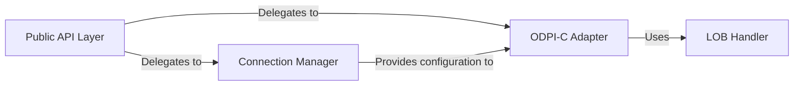

## Details

One paragraph explaining the functionality which is represented by this graph. What the main flow is and what is its purpose.

### Public API Layer
Implements the standard Go `database/sql/driver` interfaces, serving as the primary entry point for client applications. It translates calls from the `database/sql` package into actions on the driver's internal connection and statement objects. This layer ensures Go ecosystem compatibility.

**Related Classes/Methods**:

- `godrorDriver.Open`
- `conn.Prepare`
- `conn.Begin`
- `conn.Close`
- `stmt.Exec`
- `stmt.Query`
- `stmt.Close`
- `rows.Columns`
- `rows.Next`

### Connection Manager
Responsible for parsing Data Source Name (DSN) strings and managing connection parameters. It encapsulates the complex logic of configuring a connection, including credentials, pooling, and session settings, before establishing the connection via the ODPI-C adapter.

**Related Classes/Methods**:

- `godrorDriver.Open`
- `ParseDSN`
- `connect`

### ODPI-C Adapter
The core of the driver. It acts as a direct wrapper around the ODPI-C library, using CGo to bridge Go and C. This component manages the lifecycle of ODPI-C handles (connections, statements) and orchestrates C function calls. Crucially, it performs the primary data type conversion for all non-LOB types.

**Related Classes/Methods**:

- `(c *conn) Exec`
- `(c *conn) query`
- `(s *stmt) exec`
- `(s *stmt) query`
- `NewVar`
- `(v *Var) Set`
- `(v *Var) Get`

### LOB Handler
A specialized component for handling Large Object (LOB) data types. It implements `io.Reader`, `io.Writer`, and `io.Closer` to provide efficient, chunk-based streaming of data to and from Oracle. This is architecturally separate because LOBs cannot be handled in a single memory buffer and require their own lifecycle management.

**Related Classes/Methods**:

- `Lob.Read`
- `Lob.Write`
- `Lob.Close`

### [FAQ](https://github.com/CodeBoarding/GeneratedOnBoardings/tree/main?tab=readme-ov-file#faq)