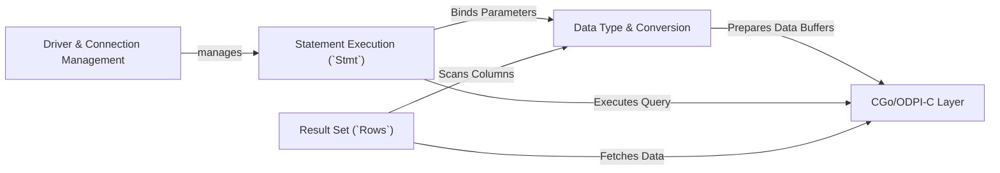

## Details

An architectural analysis of the `godror` Data Type & Conversion subsystem reveals a specialized layer designed to bridge the gap between Go's type system and Oracle's native data formats. This component is not a user-facing feature but a critical internal dependency for handling data I/O efficiently and accurately.

### Driver & Connection Management [[Expand]](./Driver_Connection_Management.md)
Initializes the driver and manages the pool of connections to the Oracle database. It handles the lifecycle of sessions, including authentication, transaction control (`Begin`, `Commit`, `Rollback`), and closing connections.

**Related Classes/Methods**:

- `godror.go`
- `conn.go`

### Statement Execution (`Stmt`)
Represents a single, prepared SQL statement. It is responsible for binding input parameters before execution and managing the statement's lifecycle on the database server.

**Related Classes/Methods**:

- `stmt.go`

### Result Set (`Rows`)
Acts as an iterator over the results returned from a query. It manages the cursor and is responsible for fetching data row by row from the underlying database buffers.

**Related Classes/Methods**:

- `rows.go`

### Data Type & Conversion [[Expand]](./Data_Type_Conversion.md)
Performs the critical task of marshalling data between Go's native types (e.g., `string`, `int`) and Oracle's internal data representations (e.g., `VARCHAR2`, `NUMBER`). It ensures data is correctly converted and transmitted.

**Related Classes/Methods**:

- `var.go`

### CGo/ODPI-C Layer
A low-level abstraction layer that directly interfaces with the Oracle Data Provider for C (ODPI-C) library via CGo. It encapsulates all `unsafe` C calls, managing memory and handles for Oracle objects.

**Related Classes/Methods**:

- `odpi.go`
- `z*.go`

### [FAQ](https://github.com/CodeBoarding/GeneratedOnBoardings/tree/main?tab=readme-ov-file#faq)