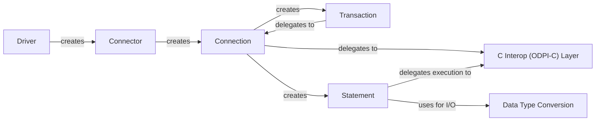

## Details

One paragraph explaining the functionality which is represented by this graph. What the main flow is and what is its purpose.

### Driver
The global driver entry point registered with `database/sql`. Its sole responsibility is to parse the DSN and create a `Connector`.

**Related Classes/Methods**:

- `driver.go`

### Connector
Holds immutable connection configuration. Its purpose is to create new `Connection` objects for the connection pool on demand.

**Related Classes/Methods**:

- `driver.go`

### Connection
Represents an active database session. It is the central hub for managing transactions, preparing statements, and executing direct queries.

**Related Classes/Methods**:

- `conn.go`

### Transaction
Implements the `driver.Tx` interface, managing the state of a database transaction and providing `Commit` and `Rollback` methods.

**Related Classes/Methods**:

- `tx.go`

### Statement
Represents a prepared SQL statement (`driver.Stmt`). It manages query execution, parameter binding, and result set iteration.

**Related Classes/Methods**:

- `stmt.go`

### C Interop (ODPI-C) Layer
The low-level abstraction layer that uses CGo to communicate with the Oracle ODPI-C library. It translates Go calls into C function calls.

**Related Classes/Methods**:

- `orahlp.go`
- `z*.go`

### Data Type Conversion [[Expand]](./Data_Type_Conversion.md)
A utility component responsible for converting data between Go native types (e.g., `string`, `int`, `time.Time`) and Oracle's internal data types.

**Related Classes/Methods**:

- `data.go`
- `lob.go`

### [FAQ](https://github.com/CodeBoarding/GeneratedOnBoardings/tree/main?tab=readme-ov-file#faq)