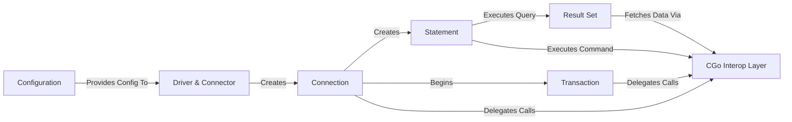

## Details

One paragraph explaining the functionality which is represented by this graph. What the main flow is and what is its purpose.

### Driver & Connector
Serves as the primary entry point for the driver. The `Driver` struct satisfies the traditional `driver.Driver` interface, while the `Connector` provides a modern, context-aware mechanism for creating connections, encapsulating all connection parameters.

**Related Classes/Methods**:

- `driver.go`

### Connection
Implements the `driver.Conn` interface. It represents an active database session and acts as a factory for creating statements and managing transactions. This component is central to all database interactions.

**Related Classes/Methods**:

- `conn.go`

### Statement
Implements the `driver.Stmt` interface for prepared statements. It is responsible for executing SQL queries and commands, binding input parameters, and managing the lifecycle of a specific SQL operation.

**Related Classes/Methods**:

- `stmt.go`

### Result Set
Implements the `driver.Rows` interface, providing a forward-only iterator over the rows returned by a query. It is designed for efficient, streaming data retrieval from the database.

**Related Classes/Methods**:

- `rows.go`

### Transaction
Implements the `driver.Tx` interface, providing `Commit` and `Rollback` methods. This component ensures that a series of operations can be executed atomically, maintaining data integrity.

**Related Classes/Methods**:

- `tx.go`

### CGo Interop Layer
Acts as the low-level bridge between the Go components and the C-based ODPI-C library. It translates Go calls and data types into their C equivalents and manages the underlying Oracle session handles.

**Related Classes/Methods**:

- `odpi.go`

### Configuration
Responsible for parsing the Data Source Name (DSN) connection string into a structured configuration object. This configuration is then used by the `Connector` to establish a database connection.

**Related Classes/Methods**:

- `dsn.go`

### [FAQ](https://github.com/CodeBoarding/GeneratedOnBoardings/tree/main?tab=readme-ov-file#faq)