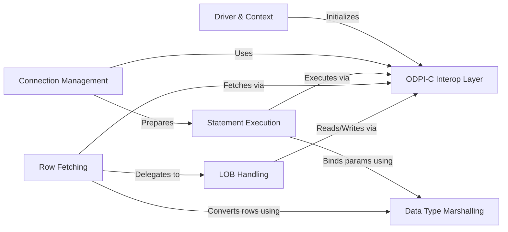

## Details

One paragraph explaining the functionality which is represented by this graph. What the main flow is and what is its purpose.

### Driver & Context
The entry point for the `database/sql` package. It's responsible for registering the `godror` driver and initializing the global ODPI-C context (`dpiContext`), which is required for all subsequent library calls.

**Related Classes/Methods**:

- `init()`
- `godrorDriver`
- `drv.Open()`

### ODPI-C Interop Layer [[Expand]](./ODPI_C_Interop_Layer.md)
A low-level facade that abstracts the ODPI-C library. It uses CGo to make direct calls to the C library, managing memory, handling C pointers, and translating error codes, effectively bridging the Go and C worlds.

**Related Classes/Methods**:

- `import "C"`
- `C.dpiContext_create`
- `C.dpiConn_create`
- `C.dpiStmt_execute`
- `C.dpiData`
- `C.dpiLob`

### Connection Management [[Expand]](./Connection_Management.md)
Represents a single database session and implements the `driver.Conn` interface. It encapsulates a C-level connection handle (`C.dpiConn`) and manages the session's lifecycle, including transactions (begin, commit, rollback) and statement preparation.

**Related Classes/Methods**:

- `conn`
- `(c *conn) PrepareContext()`
- `(c *conn) BeginTx()`
- `(c *conn) Commit()`
- `(c *conn) Rollback()`

### Statement Execution
Implements the `driver.Stmt` interface for a prepared SQL statement. It holds a C statement handle (`C.dpiStmt`), manages parameter binding (converting Go types to C), and executes the SQL against the database.

**Related Classes/Methods**:

- `stmt`
- `(s *stmt) ExecContext()`
- `(s *stmt) QueryContext()`
- `(s *stmt) Close()`

### Row Fetching
Implements the `driver.Rows` interface to iterate over a result set. Its primary role is to fetch data row-by-row from the C layer and manage the translation of ODPI-C data types into native Go types for application use.

**Related Classes/Methods**:

- `rows`
- `(r *rows) Columns()`
- `(r *rows) Next()`

### Data Type Marshalling
A specialized component responsible for the complex logic of converting data between Go types and ODPI-C's internal `dpiData` format. It is used during both parameter binding (Go to C) and row fetching (C to Go).

**Related Classes/Methods**:

- `(s *stmt) bind()`
- `(r *rows) Next()`
- `data.go`

### LOB Handling
Provides specialized handling for Large Object (LOB) types like `BLOB` and `CLOB`. It manages streaming reads and writes for data that is too large to fit in memory, interacting directly with the ODPI-C LOB APIs.

**Related Classes/Methods**:

- `Lob`
- `(r *Lob) Read()`
- `(w *Lob) Write()`
- `(l *Lob) Close()`

### [FAQ](https://github.com/CodeBoarding/GeneratedOnBoardings/tree/main?tab=readme-ov-file#faq)