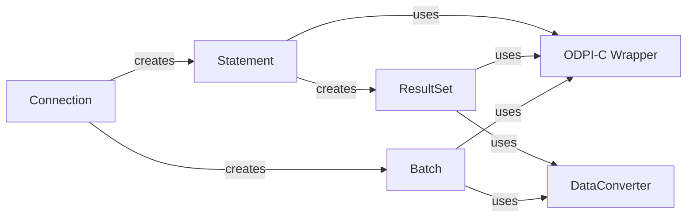

## Details

One paragraph explaining the functionality which is represented by this graph. What the main flow is and what is its purpose.

### Statement
Represents a single, prepared SQL statement. It manages parameter binding, execution, and the creation of a `ResultSet` for queries. This is the primary workhorse for all SQL commands.

**Related Classes/Methods**:

- `stmt.go`

### ResultSet
Manages the result of a query execution. It acts as a forward-only cursor, providing an iterator (`Next()`) to access rows one by one from the underlying database cursor.

**Related Classes/Methods**:

- `rows.go`

### Batch
A specialized component for executing multiple, similar DML statements (e.g., `INSERT`) in a single database round-trip. It collects parameter sets and sends them as one operation to optimize performance.

**Related Classes/Methods**:

- `batch.go`

### Connection
Represents a database session and acts as a factory. It is responsible for creating `Statement` and `Batch` objects that will be executed within its transactional context.

**Related Classes/Methods**:

- `Conn.PrepareContext`

### ODPI-C Wrapper
A low-level abstraction layer that makes direct CGo calls to the ODPI-C library. It hides the complexity of C interoperability, memory management, and error handling from the rest of the driver.

**Related Classes/Methods**:

- `odpi.go`

### DataConverter
A crucial utility component responsible for the bidirectional conversion of data types between Go's native types (e.g., `string`, `int64`, `time.Time`) and Oracle's internal data formats.

**Related Classes/Methods**:

- `odpiData.go`

### [FAQ](https://github.com/CodeBoarding/GeneratedOnBoardings/tree/main?tab=readme-ov-file#faq)