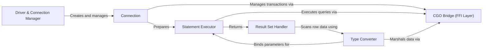

## Details

One paragraph explaining the functionality which is represented by this graph. What the main flow is and what is its purpose.

### Driver & Connection Manager
The entry point for the driver, responsible for registering itself with Go's `database/sql` package. It parses the DSN (Data Source Name) and manages a pool of database connections.

**Related Classes/Methods**:

- `driver.go`

### Connection
Represents a single session with the Oracle database, implementing the `driver.Conn` interface. It handles transaction control (`Begin`, `Commit`, `Rollback`) and the creation of prepared statements.

**Related Classes/Methods**:

- `conn.go`

### Statement Executor
Manages the lifecycle of a prepared SQL statement, implementing the `driver.Stmt` interface. It handles query execution and the binding of Go data types to SQL parameters.

**Related Classes/Methods**:

- `stmt.go`

### Result Set Handler
Represents the results of a query, implementing the `driver.Rows` interface. It allows the application to iterate through rows and scan column data into Go variables.

**Related Classes/Methods**:

- `rows.go`

### Type Converter
A critical internal component for bi-directional data conversion between Go's native types (`string`, `int`, `time.Time`) and Oracle's internal data types. This logic is primarily managed within the variable handling and data binding files.

**Related Classes/Methods**:

- `var.go`
- `z_num.go`

### CGO Bridge (FFI Layer) [[Expand]](./CGO_Bridge_FFI_Layer_.md)
The low-level Foreign Function Interface (FFI) between Go and the C-based ODPI-C library. This component uses CGO to make direct calls to the Oracle client, managing memory, data pointers, and error handling across the Go/C boundary.

**Related Classes/Methods**:

- `odpi.go`
- `z_obj.go`
- `z_lob.go`

### [FAQ](https://github.com/CodeBoarding/GeneratedOnBoardings/tree/main?tab=readme-ov-file#faq)