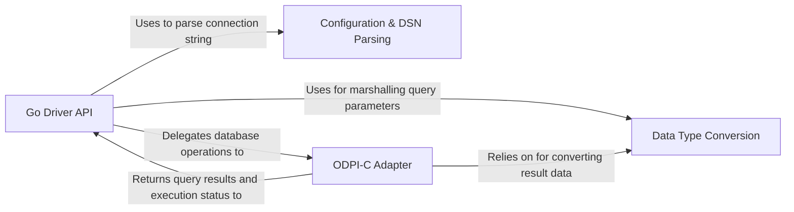

## Details

The `godror` driver is architecturally designed as a classic Adapter, creating a vital bridge between the standard Go `database/sql` interface and Oracle's C-based ODPI-C client library. The data flow is initiated when an application interacts with the `Go Driver API`, which handles connection, statement, and result set management. This top-level API relies on the `Configuration & DSN Parsing` component to interpret the user's connection string. For any actual database interaction, such as executing a query or fetching results, the API layer delegates the call to the core `ODPI-C Adapter`. This adapter uses CGo to translate the request into a call to the underlying C library. Throughout this process, the `Data Type Conversion` component is used by both the API and adapter layers to seamlessly marshal data between Go's native types and Oracle's specific data formats.

### Go Driver API [[Expand]](./Go_Driver_API.md)
Implements Go's standard `database/sql/driver` interface, serving as the primary entry point. It manages connections, statements, and result sets, orchestrating the overall workflow.

**Related Classes/Methods**:

- `driver.go`
- `conn.go`
- `stmt.go`
- `rows.go`

### Configuration & DSN Parsing
Parses the Data Source Name (DSN) string to extract and validate connection parameters like username, password, and connection details.

**Related Classes/Methods**:

- `dsn.go`

### ODPI-C Adapter
The core architectural bridge using CGo to translate Go calls into C-level operations for the ODPI-C library, managing the underlying Oracle session handles.

**Related Classes/Methods**:

- `odpi.go`

### Data Type Conversion [[Expand]](./Data_Type_Conversion.md)
A specialized component responsible for the complex marshalling of data between Go native types (string, int, time.Time) and Oracle's data types (VARCHAR2, NUMBER, LOBs).

**Related Classes/Methods**:

- `z_lob.go`
- `odpi.go`

### [FAQ](https://github.com/CodeBoarding/GeneratedOnBoardings/tree/main?tab=readme-ov-file#faq)