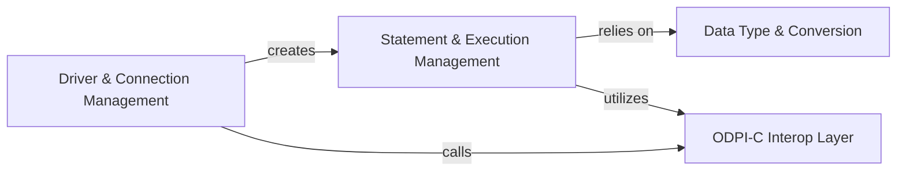

## Details

The feedback is valid and highlights a critical interaction that was previously underspecified. A `Connection` object is indeed the factory for `Statement` objects in the `database/sql/driver` pattern. The original analysis used the vague term "calls" to describe the relationship between `Driver & Connection Management` and `Statement & Execution Management`. The feedback allows for a more precise and architecturally significant description: "creates".

This change clarifies the data flow, showing that the lifecycle of a statement is initiated and managed by an active connection.

### Driver & Connection Management [[Expand]](./Driver_Connection_Management.md)
Implements Go's standard `database/sql/driver` interface, acting as the primary entry point. It manages the entire connection lifecycle, including parsing connection strings, handling authentication, and controlling transactions (commit/rollback).

**Related Classes/Methods**:

- `driver.go`
- `conn.go`
- `tx.go`

### Statement & Execution Management [[Expand]](./Statement_Execution_Management.md)
Manages all aspects of SQL statement execution. It is responsible for preparing statements, binding parameters, executing queries and commands, and processing results by managing cursors for row-by-row data retrieval.

**Related Classes/Methods**:

- `stmt.go`
- `rows.go`
- `batch.go`

### Data Type & Conversion [[Expand]](./Data_Type_Conversion.md)
Performs the critical task of marshalling data between Go's native types (e.g., `string`, `int`) and Oracle's internal data representations (e.g., `VARCHAR2`, `NUMBER`). It ensures data is correctly converted and transmitted.

**Related Classes/Methods**:

- `var.go`

### ODPI-C Interop Layer [[Expand]](./ODPI_C_Interop_Layer.md)
A low-level facade that abstracts the ODPI-C library. It uses CGo to make direct calls to the C library, managing memory, handling C pointers, and translating error codes, effectively bridging the Go and C worlds.

**Related Classes/Methods**:

- `odpi.go`

### [FAQ](https://github.com/CodeBoarding/GeneratedOnBoardings/tree/main?tab=readme-ov-file#faq)