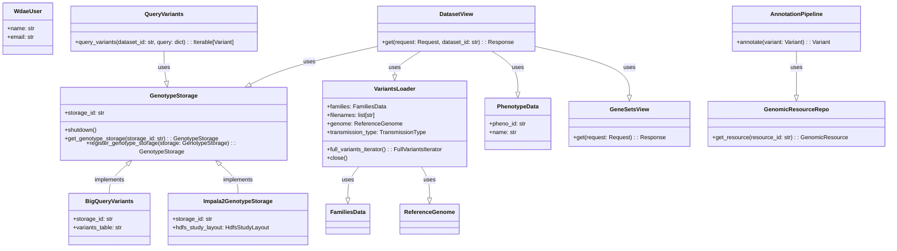

Based on the provided information, the core component is the **Data Management and Access**. This component is responsible for handling the storage, retrieval, and transformation of various data types, including genomic variants, phenotype data, gene sets, and user-related information. It provides a unified interface for accessing and manipulating data from different sources, ensuring data consistency and integrity.

Here's a breakdown of the key classes and their purposes:

*   **`dae.genotype_storage.genotype_storage.GenotypeStorage`**: Manages the storage and retrieval of genomic variant data. It acts as an abstraction layer, allowing the system to interact with different storage backends (e.g., Impala, BigQuery, Parquet) in a consistent manner.
*   **`dae.variants_loaders.raw.loader.VariantsLoader`**: Loads variant data from different file formats (e.g., VCF, Parquet, DAE). It handles the parsing and transformation of raw data into a format suitable for storage and analysis.
*   **`dae.pheno.pheno_data.PhenotypeData`**: Provides access to phenotype data associated with individuals and families. It allows the system to retrieve and analyze phenotype information, which can be used in conjunction with genomic data to identify genotype-phenotype correlations.
*   **`users_api.models.WdaeUser`**: Represents a user in the system. It stores user-related information such as username, email, and permissions.
*   **`gene_sets.views.GeneSetsView`**: Provides API endpoints for accessing and managing gene sets. Gene sets are collections of genes that share a common function or pathway.
*   **`gcp_storage.bigquery_variants.BigQueryVariants`**: Implements the `GenotypeStorage` interface for Google BigQuery. It allows the system to store and query variant data in BigQuery.
*   **`impala2_storage.schema2.impala2_genotype_storage.Impala2GenotypeStorage`**: Implements the `GenotypeStorage` interface for Impala. It allows the system to store and query variant data in Impala.
*   **`dae.annotation.annotation_pipeline.AnnotationPipeline`**: Annotates genomic variants with functional and genomic information.
*   **`dae.genomic_resources.repository.GenomicResourceRepo`**: Manages access to genomic resources such as reference genomes, gene models, and annotation scores.
*   **`dae.query_variants.base_query_variants.QueryVariants`**: Enables querying of genomic variants based on various criteria.

**Main Flow:**

1.  **Data Loading:** `VariantsLoader` loads data from various sources.
2.  **Data Storage:** `GenotypeStorage` stores the loaded data into a specific backend (e.g., Impala, BigQuery).
3.  **Data Querying:** `QueryVariants` retrieves data from `GenotypeStorage` based on user queries.
4.  **Data Access:** `PhenotypeData`, `GeneSetsView`, and `WdaeUser` provide access to phenotype, gene set, and user data, respectively.
5.  **API Access:** API views like `DatasetView` expose the data and functionalities through REST endpoints.

**Visualization:**

I will use a class diagram to represent the structure of the Data Management and Access component.

**Component Description:**

The Data Management and Access component is central to the system, providing a unified interface for interacting with diverse data sources. The `GenotypeStorage` abstraction enables seamless switching between different storage backends, while `VariantsLoader` handles the complexities of loading data from various file formats. The API layer, exemplified by `DatasetView`, exposes these functionalities to external clients.