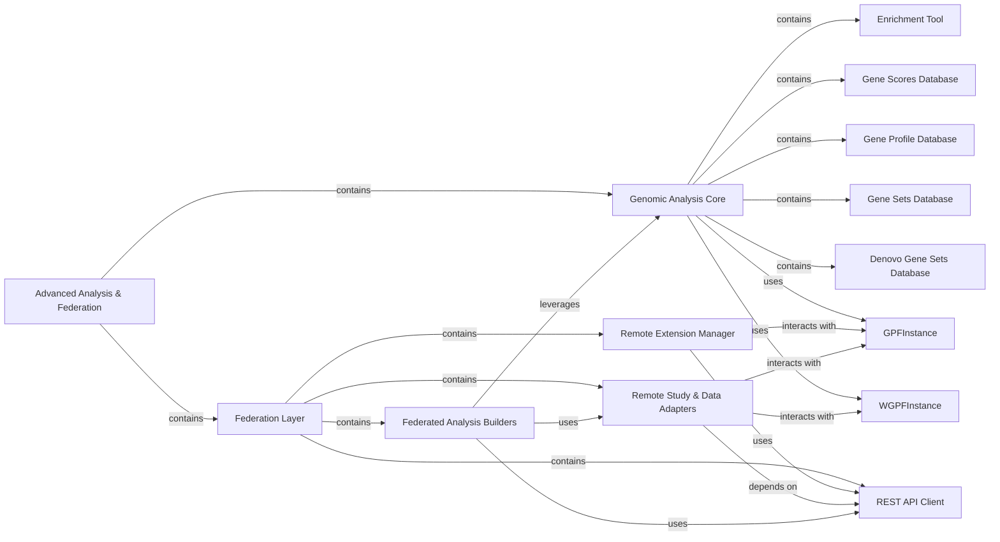

## Component Details

This subsystem is a critical part of GPF, providing sophisticated genomic analysis capabilities and enabling seamless data access and computation across distributed GPF instances. It is divided into two main functional areas: local genomic analysis and federated data access/analysis.

### Advanced Analysis & Federation
This subsystem is a critical part of GPF, providing sophisticated genomic analysis capabilities and enabling seamless data access and computation across distributed GPF instances. It is divided into two main functional areas: local genomic analysis and federated data access/analysis.

**Related Classes/Methods**: _None_

### Genomic Analysis Core
This is the foundational sub-component responsible for performing higher-level genomic analyses on local GPF data. It provides the tools and databases necessary for gene set analysis, gene profiling, and genomic scoring.

**Related Classes/Methods**: _None_

### Enrichment Tool
Facilitates gene set and enrichment analysis. It manages enrichment configurations, creates and loads background models (e.g., `GeneWeightsEnrichmentBackground`, `GeneScoreEnrichmentBackground`, `SamochaEnrichmentBackground`), and performs enrichment tests on genotype data. It also handles caching of enrichment event counts for performance.

**Related Classes/Methods**:

- <a href="https://github.com/iossifovlab/gpf/blob/master/dae/dae/enrichment_tool/enrichment_helper.py#L36-L285" target="_blank" rel="noopener noreferrer">`gpf.dae.dae.enrichment_tool.enrichment_helper.EnrichmentHelper` (36:285)</a>

### Gene Scores Database
Manages and provides access to pre-computed gene scores. It stores `GeneScore` objects and allows retrieval of score IDs, descriptions, and histograms, crucial for quantifying gene impact.

**Related Classes/Methods**:

- <a href="https://github.com/iossifovlab/gpf/blob/master/dae/dae/gene_scores/gene_scores.py#L386-L459" target="_blank" rel="noopener noreferrer">`gpf.dae.dae.gene_scores.gene_scores.GeneScoresDb` (386:459)</a>

### Gene Profile Database
Stores and retrieves gene expression profiles or other gene-specific data, enabling gene profiling analyses.

**Related Classes/Methods**:

- `gpf.dae.dae.gene_profile.gene_profile_db.GeneProfileDB` (1:1)

### Gene Sets Database
Manages and provides access to curated collections of genes (gene sets) used in enrichment analysis and other gene-centric queries.

**Related Classes/Methods**:

- <a href="https://github.com/iossifovlab/gpf/blob/master/dae/dae/gene_sets/gene_sets_db.py#L274-L341" target="_blank" rel="noopener noreferrer">`gpf.dae.dae.gene_sets.gene_sets_db.GeneSetsDb` (274:341)</a>

### Denovo Gene Sets Database
Specifically handles and provides access to de novo (newly discovered) gene sets, often derived from specific research findings.

**Related Classes/Methods**:

- `gpf.dae.dae.denovo_gene_sets.denovo_gene_sets_db.DenovoGeneSetsDb` (1:1)

### Federation Layer
This sub-component enables GPF instances to query and access data from other distributed GPF instances, facilitating federated analyses and data sharing.

**Related Classes/Methods**: _None_

### Remote Extension Manager
Orchestrates the discovery, loading, and management of functionalities (extensions) provided by remote GPF instances. It acts as the primary entry point for initiating federated operations, registering remote studies, enrichment builders, pheno tool adapters, gene set collections, and genomic scores into the local GPF instance.

**Related Classes/Methods**:

- <a href="https://github.com/iossifovlab/gpf/blob/master/federation/federation/remote_extension.py#L48-L134" target="_blank" rel="noopener noreferrer">`gpf.federation.federation.remote_extension.load_extension` (48:134)</a>

### REST API Client
Provides the core communication layer for interacting with remote GPF instances. It handles sending requests and receiving responses over HTTP/REST.

**Related Classes/Methods**:

- <a href="https://github.com/iossifovlab/gpf/blob/master/federation/federation/rest_api_client.py#L1-L1" target="_blank" rel="noopener noreferrer">`gpf.federation.federation.rest_api_client.RestApiClient` (1:1)</a>

### Remote Study & Data Adapters
A set of components that abstract the access to remote genomic data, including studies, phenotype data, and variant information. They make remote data appear as if it were local, simplifying federated queries.

**Related Classes/Methods**:

- <a href="https://github.com/iossifovlab/gpf/blob/master/federation/federation/remote_study.py#L1-L1" target="_blank" rel="noopener noreferrer">`gpf.federation.federation.remote_study.RemoteStudy` (1:1)</a>
- <a href="https://github.com/iossifovlab/gpf/blob/master/federation/federation/remote_study_wrapper.py#L1-L1" target="_blank" rel="noopener noreferrer">`gpf.federation.federation.remote_study_wrapper.RemoteStudyWrapper` (1:1)</a>
- <a href="https://github.com/iossifovlab/gpf/blob/master/federation/federation/remote_phenotype_data.py#L15-L183" target="_blank" rel="noopener noreferrer">`gpf.federation.federation.remote_phenotype_data.RemotePhenotypeData` (15:183)</a>
- <a href="https://github.com/iossifovlab/gpf/blob/master/federation/federation/remote_variant.py#L132-L150" target="_blank" rel="noopener noreferrer">`gpf.federation.federation.remote_variant.RemoteVariant` (132:150)</a>

### Federated Analysis Builders
Components responsible for constructing and executing specific analysis tasks (like enrichment analysis or pheno tool queries) by leveraging data and functionalities from federated GPF instances.

**Related Classes/Methods**:

- <a href="https://github.com/iossifovlab/gpf/blob/master/federation/federation/remote_enrichment_builder.py#L9-L34" target="_blank" rel="noopener noreferrer">`gpf.federation.federation.remote_enrichment_builder.RemoteEnrichmentBuilder` (9:34)</a>
- <a href="https://github.com/iossifovlab/gpf/blob/master/federation/federation/remote_pheno_tool_adapter.py#L7-L27" target="_blank" rel="noopener noreferrer">`gpf.federation.federation.remote_pheno_tool_adapter.RemotePhenoToolAdapter` (7:27)</a>

### GPFInstance
A GPF (Genomic Phenotype Federation) instance.

**Related Classes/Methods**: _None_

### WGPFInstance
A WGPF (Web Genomic Phenotype Federation) instance.

**Related Classes/Methods**: _None_

### [FAQ](https://github.com/CodeBoarding/GeneratedOnBoardings/tree/main?tab=readme-ov-file#faq)