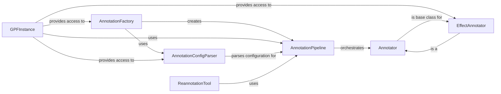

## Component Details

### AnnotationPipeline
The AnnotationPipeline orchestrates the annotation process by applying a sequence of annotators to a given annotatable object. It manages the execution of annotators, handles genomic contexts, and provides methods for adding annotators and performing annotation in batch or individually. It is the central component that drives the annotation workflow.
- **Related Classes/Methods**: `dae.annotation.annotation_pipeline.AnnotationPipeline`

### Annotator
Annotator is an abstract base class for annotators, which are responsible for adding specific attributes to annotatables. It defines the interface for annotation, including methods for opening and closing resources, annotating individual annotatables, and batch annotation. All annotators inherit from this class.
- **Related Classes/Methods**: `dae.annotation.annotator_base.AnnotatorBase`

### AnnotationFactory
The AnnotationFactory is responsible for constructing an `AnnotationPipeline` from a configuration. It uses registered annotator factories to create individual annotators, decorates them with input annotatable and value transform decorators, and adds them to the pipeline. It is the entry point for creating annotation pipelines.
- **Related Classes/Methods**: `dae.annotation.annotation_factory.build_annotation_pipeline`

### GPFInstance
GPFInstance is a central class that provides access to various components of the GPF (Genomic Processing Framework) instance, including the reference genome, gene models, annotation pipeline, and genotype data. It manages the configuration and loading of these components. It is the central access point for all GPF resources.
- **Related Classes/Methods**: `dae.gpf_instance.gpf_instance.GPFInstance`, `repos.gpf.dae.dae.gpf_instance.gpf_instance.GPFInstance`

### EffectAnnotator
EffectAnnotator is a specialized annotator that predicts the effects of variants based on gene models and a reference genome. It uses a list of effect checkers to determine the most likely effect for a given variant and transcript. It is a key component for variant effect prediction.
- **Related Classes/Methods**: `dae.effect_annotation.annotator.EffectAnnotator`

### AnnotationConfigParser
AnnotationConfigParser parses annotation pipeline configurations from YAML files or dictionaries. It handles different configuration formats, including minimal, short, and complete forms, and creates `AnnotatorInfo` objects representing the configured annotators. It is responsible for parsing the annotation pipeline configuration.
- **Related Classes/Methods**: `dae.annotation.annotation_config.AnnotationConfigParser`

### ReannotationTool
ReannotationTool is a tool for reannotating a GPF instance. It identifies studies that need reannotation, generates a task graph for the reannotation process, and executes the task graph using the TaskGraphCli. It is responsible for reannotating GPF instances.
- **Related Classes/Methods**: `dae.annotation.reannotate_instance.ReannotateInstanceTool`
