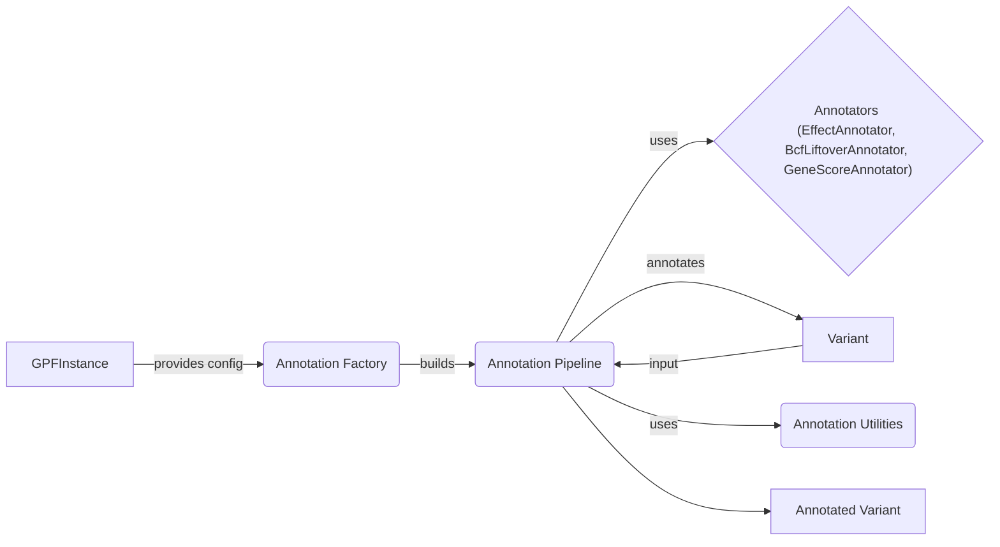

## Annotation Engine Overview

The Annotation Engine performs variant annotation using a configurable pipeline of annotators. It leverages genomic resources from the GRR and produces annotated variants.

Here's a high-level data flow diagram illustrating the process:

### Component Descriptions:

*   **GPFInstance**: Provides access to the annotation pipeline configuration. It acts as a central point for accessing annotation resources within the GPF. It provides the configuration to the Annotation Factory.
    *   Relevant source files: `dae.gpf_instance.gpf_instance.GPFInstance`
*   **Annotation Factory**: Builds the annotation pipeline based on the configuration received from the GPFInstance. It instantiates and configures the annotators and assembles them into a pipeline. It builds the Annotation Pipeline.
    *   Relevant source files: `dae.annotation.annotation_factory.build_annotation_pipeline`
*   **Annotation Pipeline**: Orchestrates the annotation process by applying a series of annotators to a variant. It manages the execution order and data flow between annotators. It uses Annotators and Annotation Utilities to annotate the Variant.
    *   Relevant source files: `dae.annotation.annotation_pipeline.AnnotationPipeline`
*   **Annotators (EffectAnnotator, BcfLiftoverAnnotator, GeneScoreAnnotator)**: Individual annotators that add specific information to a variant. Each annotator performs a specific annotation task, such as predicting the effect of a variant, lifting over coordinates, or adding gene scores. They receive a variant as input and add annotations to it.
    *   Relevant source files: `dae.annotation.annotator.EffectAnnotator`, `dae.annotation.liftover_annotator.BcfLiftoverAnnotator`, `dae.annotation.gene_score_annotator.GeneScoreAnnotator`
*   **Variant**: Represents the input variant to be annotated. The Annotation Pipeline takes a variant as input.
    *   Relevant source files: N/A (Represents the data input)
*   **Annotation Utilities**: Provides utility functions for annotation tasks, such as producing regions, handling partfile paths, and creating tabix indices. These utilities support the annotation process by providing common functionalities. The Annotation Pipeline uses these utilities.
    *   Relevant source files: `dae.annotation.annotate_utils`
*   **Annotated Variant**: Represents the output variant with added annotations. The Annotation Pipeline outputs the annotated variant.
    *   Relevant source files: N/A (Represents the data output)
