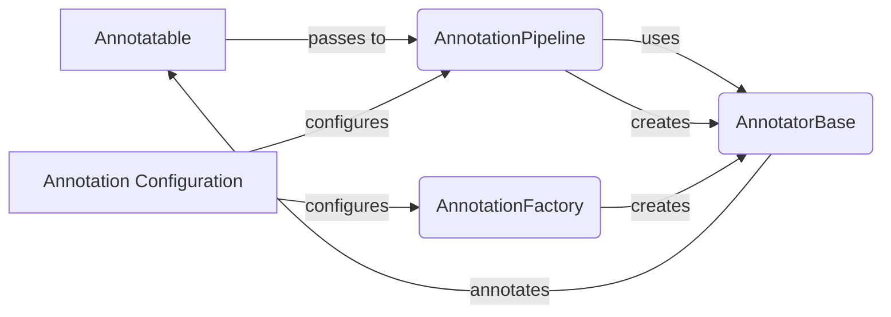

## Annotation Engine Overview

The Annotation Engine orchestrates the process of annotating genomic variants using configurable annotation pipelines. It leverages an `AnnotationPipeline` to manage the execution of individual `AnnotatorBase` instances created by the `AnnotationFactory`. The engine enriches variants with relevant annotations by sequentially applying these annotators.

Here's a component flow diagram illustrating the data flow within the Annotation Engine:

### Component Descriptions:

- **Annotatable**: Represents the genomic variant to be annotated. It serves as the input and is enriched with annotations during the pipeline execution. **Relevant source file:** `dae.annotation.annotatable`

- **AnnotationPipeline**: Manages the sequence of annotators. It receives an `Annotatable`, iterates through the configured annotators, and applies each one to the variant. The pipeline also handles opening and closing of annotators. **Relevant source file:** `dae.annotation.annotation_pipeline.AnnotationPipeline`

- **AnnotatorBase**: Abstract base class for all annotators. Each annotator implements the `annotate` method, which performs the specific annotation logic. The base class also handles loading resources and defining attribute types. **Relevant source file:** `dae.annotation.annotator_base.AnnotatorBase`

- **AnnotationFactory**: Responsible for creating instances of specific annotators based on the configuration. It uses a registry of available annotator types and their corresponding factory functions. **Relevant source file:** `dae.annotation.annotation_factory`

- **Annotation Configuration**: Defines the structure and order of the annotation pipeline, as well as the parameters for each annotator. This configuration is used by the `AnnotationFactory` and `AnnotationPipeline` to build and execute the annotation process. **Relevant source file:** `dae.annotation.annotation_config`
