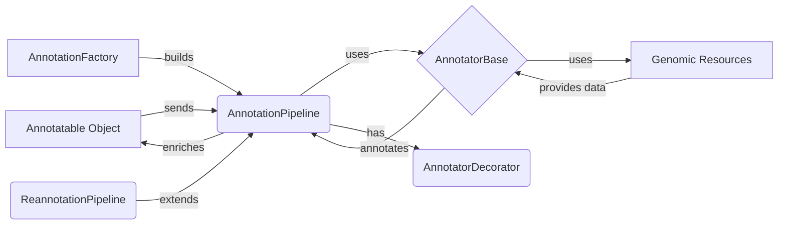

## Annotation Engine Overview

The Annotation Engine orchestrates the process of annotating genomic variants by utilizing configured annotators and genomic resources. It receives annotatable objects, applies a series of annotations, and enriches the objects with relevant information.

### Data Flow Diagram

### Component Descriptions

*   **Annotatable Object:** Represents the genomic variant or region to be annotated. It serves as the input to the annotation pipeline and is enriched with annotation attributes.
    *   **Relevant source files:** N/A - Represents input data.

*   **AnnotationPipeline:** Orchestrates the annotation process by managing a list of annotators and applying them sequentially to annotatables. It handles the genomic context and resource management, ensuring each annotatable is processed through the configured annotators.
    *   **Purpose:** Manages the sequence of annotators and applies them to the annotatable object.
    *   **Interaction:** Receives annotatable objects, uses `AnnotatorBase` instances to annotate them, and enriches the objects with the results. It is built by the `AnnotationFactory`.
    *   **Relevant source files:** `dae/annotation/annotation_pipeline.py`

*   **AnnotatorBase:** Abstract base class for annotators, providing a common interface for annotation. It defines the basic structure for annotators, including methods for single and batch annotation, and manages the work directory and attribute configuration.
    *   **Purpose:** Provides a base class for all annotators, defining the `annotate` and `batch_annotate` methods.
    *   **Interaction:** Inherited by specific annotators that perform the actual annotation. It uses `Genomic Resources` to retrieve data and annotates the `Annotatable Object`.
    *   **Relevant source files:** `dae/annotation/annotator_base.py`

*   **Genomic Resources:** External databases and files containing genomic information used for annotation. These resources are accessed by the annotators to retrieve relevant data for annotating the annotatables.
    *   **Purpose:** Provides the data necessary for annotation.
    *   **Interaction:** Used by `AnnotatorBase` instances to retrieve annotation data.
    *   **Relevant source files:** N/A - Represents external data sources.

*   **AnnotationFactory:** Responsible for creating annotator instances and annotation pipelines based on the configuration. It uses a registry of annotator types and their corresponding factory functions to dynamically build the annotation pipeline.
    *   **Purpose:** Creates instances of `AnnotationPipeline` and `AnnotatorBase` based on configuration.
    *   **Interaction:** Builds the `AnnotationPipeline` by instantiating and configuring `AnnotatorBase` instances. It is triggered during the initialization of the annotation process.
    *   **Relevant source files:** `dae/annotation/annotation_factory.py`

*   **AnnotatorDecorator:** Base class for annotator decorators, allowing to extend or modify the behavior of existing annotators. It provides a way to add functionality to annotators without modifying their original code, enabling aspects like value transformation or input annotatable retrieval.
    *   **Purpose:** Decorates annotators to add extra functionality.
    *   **Interaction:** Wraps `AnnotatorBase` instances to modify their behavior. Used within the `AnnotationPipeline`.
    *   **Relevant source files:** `dae/annotation/annotation_pipeline.py`

*   **ReannotationPipeline:** Special pipeline that handles reannotation of a previous pipeline. It identifies the attributes that need to be recomputed and only runs the necessary annotators, optimizing the reannotation process.
    *   **Purpose:** Optimizes the reannotation process by only running necessary annotators.
    *   **Interaction:** Extends `AnnotationPipeline` to reannotate existing data. Uses the previous annotation results to determine which annotators need to be rerun.
    *   **Relevant source files:** `dae/annotation/annotation_pipeline.py`
