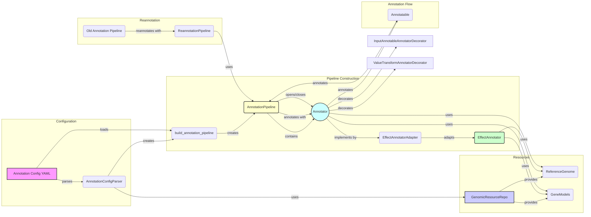

## Annotation Pipeline Overview
The Annotation Pipeline is a crucial component for annotating genetic variants with functional and genomic information. It orchestrates a series of annotators to enrich variant data with relevant annotations. The pipeline is built from a configuration file (YAML) and uses genomic resources like reference genomes and gene models.

### Component Descriptions
*   **Annotation Config YAML**: Contains the configuration for the annotation pipeline, specifying the annotators to use and their parameters.
    *   *Functionality*: Defines the structure and behavior of the annotation pipeline.
    *   *Interaction*: Parsed by `AnnotationConfigParser` to create the pipeline.
    *   *Source Files*: N/A (YAML file)
*   **AnnotationConfigParser**: Parses the annotation configuration file (YAML) and extracts relevant information for building the pipeline.
    *   *Functionality*: Transforms the raw configuration into a structured format suitable for creating annotators.
    *   *Interaction*: Reads the YAML configuration and uses `GenomicResourceRepo` to access genomic resources. Creates `AnnotatorInfo` objects.
    *   *Source Files*: `dae.annotation.annotation_config.AnnotationConfigParser`
*   **GenomicResourceRepo**: Manages access to genomic resources like reference genomes and gene models.
    *   *Functionality*: Provides a central point for retrieving and managing genomic resources.
    *   *Interaction*: Used by `AnnotationConfigParser` and annotators to access genomic resources.
    *   *Source Files*: `dae.genomic_resources.repository.GenomicResourceRepo`
*   **ReferenceGenome**: Provides access to the reference genome sequence.
    *   *Functionality*: Allows annotators to retrieve the sequence of specific regions of the genome.
    *   *Interaction*: Used by annotators like `EffectAnnotator` to determine the effects of variants.
    *   *Source Files*: `dae.genomic_resources.reference_genome.ReferenceGenome`
*   **GeneModels**: Provides access to gene models and transcript structures.
    *   *Functionality*: Allows annotators to retrieve information about genes, transcripts, exons, and introns.
    *   *Interaction*: Used by annotators like `EffectAnnotator` to determine the effects of variants on genes and transcripts.
    *   *Source Files*: `dae.genomic_resources.gene_models.GeneModels`
*   **build\_annotation\_pipeline**: Factory function that constructs an `AnnotationPipeline` from a configuration (YAML or dict).
    *   *Functionality*: Uses annotator factories to create individual annotators and adds them to the pipeline.
    *   *Interaction*: Reads the parsed configuration and creates `AnnotationPipeline` and `Annotator` instances.
    *   *Source Files*: `dae.annotation.annotation_factory.build_annotation_pipeline`
*   **AnnotationPipeline**: Orchestrates the annotation process by managing a sequence of annotators.
    *   *Functionality*: Handles the opening and closing of annotators and applies them sequentially to annotatables.
    *   *Interaction*: Contains a list of `Annotator` objects and applies them to `Annotatable` objects. Uses `GenomicResourceRepo` to access genomic resources.
    *   *Source Files*: `dae.annotation.annotation_pipeline.AnnotationPipeline`
*   **Annotator**: Abstract base class for annotators, responsible for adding specific annotations to variants.
    *   *Functionality*: Defines the `annotate` method that subclasses must implement.
    *   *Interaction*: Subclasses implement the `annotate` method to add specific annotations. Used by `AnnotationPipeline` to annotate `Annotatable` objects.
    *   *Source Files*: `dae.annotation.annotation_pipeline.Annotator`, `dae.annotation.annotator_base.AnnotatorBase`
*   **EffectAnnotatorAdapter**: Adapts the `EffectAnnotator` to fit within the annotation pipeline framework.
    *   *Functionality*: Provides variant effect predictions. Retrieves gene models and reference genome information and configures the `EffectAnnotator`.
    *   *Interaction*: Creates and configures an `EffectAnnotator` instance. Implements the `annotate` method to call the `EffectAnnotator`.
    *   *Source Files*: `dae.annotation.effect_annotator.EffectAnnotatorAdapter`
*   **EffectAnnotator**: Core annotator that predicts the effects of genetic variants on genes and transcripts.
    *   *Functionality*: Uses gene models and a reference genome to determine the impact of variants.
    *   *Interaction*: Receives variant information from `EffectAnnotatorAdapter` and uses gene models and the reference genome to predict effects.
    *   *Source Files*: `dae.effect_annotation.annotator.EffectAnnotator`
*   **Annotatable**: Represents a genomic variant or region that can be annotated.
    *   *Functionality*: Provides a common interface for accessing variant properties like chromosome, position, and allele.
    *   *Interaction*: Passed to the `AnnotationPipeline` for annotation.
    *   *Source Files*: `dae.annotation.annotatable.Annotatable`
*   **ReannotationPipeline**: A special pipeline that handles reannotation of a previous pipeline.
    *   *Functionality*: Identifies which annotators need to be rerun and which attributes can be reused from the previous annotation.
    *   *Interaction*: Uses two annotation pipelines (old and new) and determines the differences between them to optimize the reannotation process.
    *   *Source Files*: `dae.annotation.annotation_pipeline.ReannotationPipeline`
*   **InputAnnotableAnnotatorDecorator**: Defines annotator decorator to use input annotatable if defined.
    *   *Functionality*: Decorates annotators to use a specified input annotatable from the annotation context.
    *   *Interaction*: Wraps an annotator and retrieves the input annotatable from the context before calling the wrapped annotator's `annotate` method.
    *   *Source Files*: `dae.annotation.annotation_pipeline.InputAnnotableAnnotatorDecorator`
*   **ValueTransformAnnotatorDecorator**: Define value transformer annotator decorator. Used to transform values of attributes.
    *   *Functionality*: Decorates annotators to transform the values of specific attributes after annotation.
    *   *Interaction*: Wraps an annotator and applies a transformation function to the values of specified attributes after the wrapped annotator's `annotate` method is called.
    *   *Source Files*: `dae.annotation.annotation_pipeline.ValueTransformAnnotatorDecorator`
