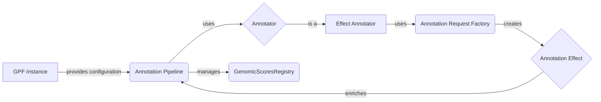

## Annotation Pipeline Overview

This diagram illustrates the flow of data and control within the annotation pipeline. It highlights the key components involved in annotating genetic variants with their potential effects.

### Component Descriptions:

*   **GPF Instance**
    *   Purpose: Provides access to the configuration and data needed for the annotation pipeline, including the pipeline configuration itself.
    *   Functionality: Loads and manages the configuration, providing access to resources like gene models and genomic scores.
    *   Interaction: Provides the configuration to the Annotation Pipeline.
    *   Relevant source files: `dae.dae_instance.GPFInstance`

*   **Annotation Pipeline**
    *   Purpose: Orchestrates the annotation process by applying a series of annotators to variants.
    *   Functionality: Manages the flow of data through the pipeline, opening and closing annotators, and handling exceptions.
    *   Interaction: Uses Annotators to enrich variants and manages the GenomicScoresRegistry.
    *   Relevant source files: `dae.annotation.annotation_pipeline.AnnotationPipeline`

*   **Annotator**
    *   Purpose: Abstract base class for annotators.
    *   Functionality: Defines the interface for annotation and resource management.
    *   Interaction: Effect Annotator is a type of Annotator.
    *   Relevant source files: `dae.annotation.annotation_pipeline.Annotator`

*   **Effect Annotator**
    *   Purpose: Specialized annotator that predicts the effects of variants on genes and proteins.
    *   Functionality: Uses gene models and a reference genome to determine the functional consequences of variants.
    *   Interaction: Uses Annotation Request Factory to create annotation requests and enriches the Annotation Pipeline with Annotation Effects.
    *   Relevant source files: `dae.effect_annotation.annotator.EffectAnnotator`

*   **Annotation Request Factory**
    *   Purpose: Creates annotation requests for the Effect Annotator.
    *   Functionality: Encapsulates the logic for creating requests based on the transcript model and variant.
    *   Interaction: Creates Annotation Effects.
    *   Relevant source files: `dae.effect_annotation.annotator.AnnotationRequestFactory`

*   **Annotation Effect**
    *   Purpose: Represents the predicted effect of a variant.
    *   Functionality: Encapsulates the type of effect, the gene affected, and other relevant details.
    *   Interaction: Enriches the Annotation Pipeline.
    *   Relevant source files: `dae.effect_annotation.effect.AnnotationEffect`

*   **GenomicScoresRegistry**
    *   Purpose: Manages the available genomic scores.
    *   Functionality: Provides access to genomic scores for annotation.
    *   Interaction: Managed by the Annotation Pipeline.
    *   Relevant source files: `dae.genomic_scores.scores.GenomicScoresRegistry`