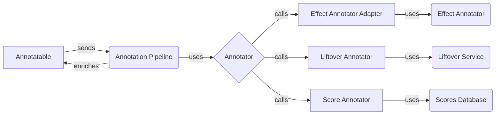

```markdown
## Annotation Pipeline Overview

The Annotation Pipeline orchestrates the process of annotating variants with functional and genomic information. It uses a series of annotators, each responsible for adding specific annotations to the variant data. The pipeline is built from a configuration file that specifies the annotators to use and their order of execution.

### Data Flow Diagram



### Components Description

- **Annotatable**
  - *Description*: Represents the variant to be annotated. It provides the basic information about the variant, such as its location and sequence.
  - *Interaction*: The `Annotation Pipeline` receives an `Annotatable` object as input and enriches it with annotations.
  - *Relevant source files*: `dae.annotation.annotatable`

- **Annotation Pipeline**
  - *Description*: Orchestrates the execution of multiple annotators. It defines the flow of data through the annotation process.
  - *Interaction*: Receives an `Annotatable` object, iterates through the configured `Annotator` instances, and applies each annotator to the `Annotatable` object. The enriched `Annotatable` object is then returned.
  - *Relevant source files*: `dae.annotation.annotation_pipeline.AnnotationPipeline`

- **Annotator**
  - *Description*: Base class for all annotators. Defines the interface for annotation and provides common functionalities.
  - *Interaction*: The `Annotation Pipeline` calls the `annotate` method of each `Annotator` instance. Each specific annotator implementation (e.g., `Effect Annotator Adapter`, `Liftover Annotator`, `Score Annotator`) performs its specific annotation logic.
  - *Relevant source files*: `dae.annotation.annotator_base.AnnotatorBase`

- **Effect Annotator Adapter**
  - *Description*: Adapts the `EffectAnnotator` to the annotation pipeline. It handles the integration of effect annotation into the broader annotation process.
  - *Interaction*: Receives an `Annotatable` object and uses the `EffectAnnotator` to predict the effects of the variant on genes and transcripts. The resulting effect annotations are then added to the `Annotatable` object.
  - *Relevant source files*: `dae.annotation.effect_annotator.EffectAnnotatorAdapter`

- **Liftover Annotator**
  - *Description*: Annotates variants by mapping their coordinates between genome builds using liftover.
  - *Interaction*: Receives an `Annotatable` object and uses a `Liftover Service` to map the variant's coordinates to a different genome build. The new coordinates are then added to the `Annotatable` object.
  - *Relevant source files*: `dae.annotation.liftover_annotator.LiftoverAnnotator`

- **Score Annotator**
  - *Description*: Annotates variants with scores from external sources.
  - *Interaction*: Receives an `Annotatable` object and queries a `Scores Database` to retrieve relevant scores for the variant. The retrieved scores are then added to the `Annotatable` object.
  - *Relevant source files*: `dae.annotation.score_annotator.ScoreAnnotator`

- **Effect Annotator**
  - *Description*: Predicts the effects of variants on genes and transcripts.
  - *Interaction*: Called by the `Effect Annotator Adapter` to perform the actual effect prediction.
  - *Relevant source files*: `dae.effect_annotation.annotator.EffectAnnotator`

- **Liftover Service**
  - *Description*: Provides the functionality to map genomic coordinates between different genome builds.
  - *Interaction*: Used by the `Liftover Annotator` to perform the coordinate mapping.
  - *Relevant source files*: (External service, not part of the dae.annotation package)

- **Scores Database**
  - *Description*: Stores precomputed scores for genomic regions.
  - *Interaction*: Queried by the `Score Annotator` to retrieve scores for specific variants.
  - *Relevant source files*: (External database, not part of the dae.annotation package)
```