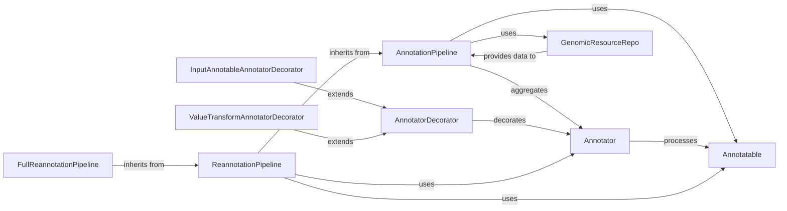

## Component Details

This subsystem is designed to systematically enrich genetic variants with diverse biological information. It operates by orchestrating a series of modular annotation steps, each performed by a dedicated `Annotator`. The core principle is to process `Annotatable` objects (representing genetic variants or genomic regions) and augment them with data from various `Genomic Resources`. The architecture supports both initial annotation and intelligent re-annotation, promoting efficiency and extensibility through a decorator pattern.

### AnnotationPipeline
The central orchestrator of the annotation process. It manages a collection of `Annotator` instances, ensuring they are properly initialized (`open()`) and finalized (`close()`). Its primary responsibility is to sequentially apply these `Annotator`s to `Annotatable` objects, accumulating and enriching the annotation context. It also establishes the necessary genomic context by interacting with a `GenomicResourceRepo`. It supports both single and batch annotation of `Annotatable`s.

**Related Classes/Methods**:

- <a href="https://github.com/iossifovlab/gpf/blob/master/dae/dae/annotation/annotation_pipeline.py#L195-L205" target="_blank" rel="noopener noreferrer">`AnnotationPipeline:open` (195:205)</a>
- <a href="https://github.com/iossifovlab/gpf/blob/master/dae/dae/annotation/annotation_pipeline.py#L207-L216" target="_blank" rel="noopener noreferrer">`AnnotationPipeline:close` (207:216)</a>
- <a href="https://github.com/iossifovlab/gpf/blob/master/dae/dae/annotation/annotation_pipeline.py#L154-L169" target="_blank" rel="noopener noreferrer">`AnnotationPipeline:annotate` (154:169)</a>
- <a href="https://github.com/iossifovlab/gpf/blob/master/dae/dae/annotation/annotation_pipeline.py#L171-L193" target="_blank" rel="noopener noreferrer">`AnnotationPipeline:batch_annotate` (171:193)</a>

### Annotator
This is the abstract base component for any individual, pluggable step within the annotation pipeline. Each concrete implementation of `Annotator` is responsible for performing a specific type of annotation (e.g., adding functional predictions, clinical significance, genomic scores) to an `Annotatable` object. It defines the interface for how an annotation step should operate, including `annotate()` and `batch_annotate()` methods.

**Related Classes/Methods**:

- <a href="https://github.com/iossifovlab/gpf/blob/master/dae/dae/effect_annotation/annotator.py#L0-L0" target="_blank" rel="noopener noreferrer">`Annotator:annotate` (0:0)</a>
- <a href="https://github.com/iossifovlab/gpf/blob/master/dae/dae/effect_annotation/annotator.py#L0-L0" target="_blank" rel="noopener noreferrer">`Annotator:batch_annotate` (0:0)</a>

### Annotatable
The fundamental data structure representing the biological entity (e.g., a genetic variant, genomic region, or position) that undergoes annotation. It encapsulates basic genomic coordinates (chromosome, start, end position) and a type (e.g., substitution, deletion, duplication). It serves as the input for the `AnnotationPipeline` and individual `Annotator` components, and its associated context is enriched throughout the pipeline.

**Related Classes/Methods**: _None_

### ReannotationPipeline
A specialized extension of `AnnotationPipeline` designed for efficient re-annotation tasks. It introduces a dependency tracking mechanism among annotators, allowing it to intelligently determine which annotation steps need to be re-executed when upstream dependencies (e.g., genomic resources or previous annotations) change. This optimizes performance by avoiding unnecessary re-computation. It can also reuse attributes from a previous annotation run.

**Related Classes/Methods**: _None_

### FullReannotationPipeline
A concrete implementation of `ReannotationPipeline` that performs a comprehensive re-annotation. Unlike its parent, it explicitly discards all previously annotated attributes and re-runs *all* annotators in the new pipeline, regardless of dependencies. This ensures a complete and fresh annotation, useful for major updates or when a clean slate is desired.

**Related Classes/Methods**: _None_

### AnnotatorDecorator
This abstract base class implements the Decorator design pattern, providing a flexible way to add responsibilities or modify the behavior of `Annotator` objects dynamically. It wraps an existing `Annotator` (its `child`) and delegates core annotation calls to it, while allowing for pre- or post-processing logic to be injected.

**Related Classes/Methods**:

- `AnnotatorDecorator:child` (0:0)
- `AnnotatorDecorator:annotate` (0:0)
- `AnnotatorDecorator:batch_annotate` (0:0)

### InputAnnotableAnnotatorDecorator
A concrete `AnnotatorDecorator` that modifies an `Annotator`'s behavior to use an `Annotatable` object retrieved from the annotation context as its input, rather than the primary `Annotatable` passed to the pipeline. This is particularly useful when an annotator needs to operate on a derived or related genomic entity that was itself an output of a previous annotator.

**Related Classes/Methods**: _None_

### ValueTransformAnnotatorDecorator
Another concrete `AnnotatorDecorator` responsible for transforming or manipulating the values produced by an `Annotator`. It applies a specified transformation function (e.g., a lambda expression) to the output attributes of the wrapped annotator, allowing for flexible post-processing, normalization, or reformatting of annotation results.

**Related Classes/Methods**: _None_

### GenomicResourceRepo
This component is part of the broader "Genomic Resources" system and is responsible for managing and providing access to various external genomic data sources. These resources (e.g., reference genomes, gene models, conservation scores, variant databases) are essential for `Annotator`s to perform their tasks. The `AnnotationPipeline` interacts with this repository to build the necessary genomic context for annotation.

**Related Classes/Methods**: _None_

### [FAQ](https://github.com/CodeBoarding/GeneratedOnBoardings/tree/main?tab=readme-ov-file#faq)