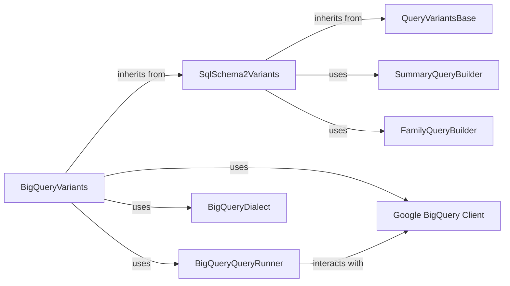

## Component Details

These components are fundamental because they represent the core layers of abstraction and implementation involved in querying genetic variants from BigQuery. `QueryVariantsBase` sets the standard, `SqlSchema2Variants` provides a generic SQL framework, and `BigQueryVariants` concretely implements this for BigQuery. `BigQueryQueryRunner` and `Google BigQuery Client` handle the direct interaction with the database, while `BigQueryDialect`, `SummaryQueryBuilder`, and `FamilyQueryBuilder` are crucial for constructing correct and efficient BigQuery SQL queries.

### BigQueryVariants
The primary concrete implementation for querying genetic variants from Google BigQuery. It adapts the generic SQL schema variant querying capabilities to the BigQuery environment, handling BigQuery-specific SQL generation, data retrieval, and result deserialization.

**Related Classes/Methods**:

- `BigQueryVariants` (0:0)

### SqlSchema2Variants
A foundational abstract class that provides a generic framework for querying variants based on a SQL schema. It defines the core logic for handling variant data structures and SQL-based queries, which are then specialized by concrete implementations like `BigQueryVariants` for specific SQL dialects. It orchestrates the query building and execution process.

**Related Classes/Methods**:

- `SqlSchema2Variants` (0:0)

### BigQueryQueryRunner
This component is dedicated to executing SQL queries against the Google BigQuery service. It encapsulates the direct interaction with the `google.cloud.bigquery` client library, managing the connection, submitting queries, and fetching results.

**Related Classes/Methods**:

- `BigQueryQueryRunner` (0:0)

### QueryVariantsBase
An abstract base class that defines the fundamental interface and common functionalities for querying and deserializing genomic variants. It establishes a contract for variant querying, ensuring consistency across different storage backends.

**Related Classes/Methods**:

- `QueryVariantsBase` (0:0)

### Google BigQuery Client
This represents the official Python client library provided by Google for interacting with the BigQuery service. It offers the necessary APIs to connect to BigQuery, execute queries, and retrieve results. This is an external dependency.

**Related Classes/Methods**:

- `google.cloud.bigquery` (0:0)

### BigQueryDialect
This component defines the specific SQL dialect rules and syntax tailored for Google BigQuery. It ensures that the SQL queries generated by the system are correctly formatted and compatible with BigQuery's query language.

**Related Classes/Methods**:

- `BigQueryDialect` (0:0)

### SummaryQueryBuilder
This component is responsible for dynamically constructing SQL queries specifically for summary variants. It processes various filtering parameters and schema information to generate optimized SQL statements for BigQuery.

**Related Classes/Methods**:

- `SummaryQueryBuilder` (0:0)

### FamilyQueryBuilder
This component is responsible for dynamically constructing SQL queries specifically for family variants. Similar to `SummaryQueryBuilder`, it takes filtering parameters and schema information to generate the appropriate SQL statement for family variant queries in BigQuery.

**Related Classes/Methods**:

- `FamilyQueryBuilder` (0:0)

### [FAQ](https://github.com/CodeBoarding/GeneratedOnBoardings/tree/main?tab=readme-ov-file#faq)