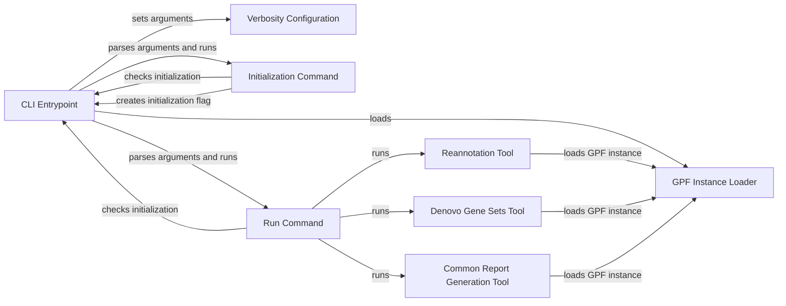

## Component Details

### CLI Entrypoint
The CLI entrypoint (`wdae.wdae.wdae.wgpf.cli`) is responsible for parsing command-line arguments, loading the GPF instance, and executing the specified command. It acts as the main interface for interacting with the GPF tools from the command line, orchestrating the execution of various subcommands like 'init' and 'run'.
- **Related Classes/Methods**: `wdae.wdae.wdae.wgpf.cli`

### GPF Instance Loader
The GPF Instance Loader (`gpf_instance.get_wgpf_instance`) is responsible for loading and managing the GPF instance configuration and data. It provides a centralized access point to the GPF instance, ensuring that all tools and components have access to the necessary data and configuration information.
- **Related Classes/Methods**: `gpf_instance.gpf_instance`

### Reannotation Tool
The Reannotation Tool (`dae.annotation.reannotate_instance.ReannotateInstanceTool`) provides functionality for reannotating instances within the GPF environment. It handles argument parsing, GPF instance loading, study identification, and task graph generation and processing for reannotation tasks.
- **Related Classes/Methods**: `dae.annotation.reannotate_instance.ReannotateInstanceTool`

### Denovo Gene Sets Tool
The Denovo Gene Sets Tool (`dae.tools.generate_denovo_gene_sets.main`) is responsible for generating denovo gene sets. It parses arguments, loads the GPF instance, and builds the denovo gene sets cache for specified studies, enabling downstream analysis of denovo mutations.
- **Related Classes/Methods**: `dae.tools.generate_denovo_gene_sets.main`

### Common Report Generation Tool
The Common Report Generation Tool (`dae.tools.generate_common_report.main`) is responsible for generating common reports. It provides a way to create standardized reports based on the data within the GPF instance.
- **Related Classes/Methods**: `dae.tools.generate_common_report.main`

### Verbosity Configuration
The Verbosity Configuration (`dae.utils.verbosity_configuration.VerbosityConfiguration.set_arguments`) configures the verbosity level of the application's logging, allowing users to control the amount of information output during execution.
- **Related Classes/Methods**: `dae.utils.verbosity_configuration`

### Initialization Command
The Initialization Command (`_run_init_command`) handles the 'init' subcommand, checking if the application is already initialized and creating the initialization flag file. This ensures that the application is properly set up before running other commands.
- **Related Classes/Methods**: `wdae.wdae.wdae.wgpf.cli`

### Run Command
The Run Command (`_run_run_command`) handles the 'run' subcommand, checking if the application is initialized and then executing the requested tool (reannotate_instance, generate_denovo_gene_sets, generate_common_report). It acts as a dispatcher for the different tools available through the command line.
- **Related Classes/Methods**: `wdae.wdae.wdae.wgpf.cli`
