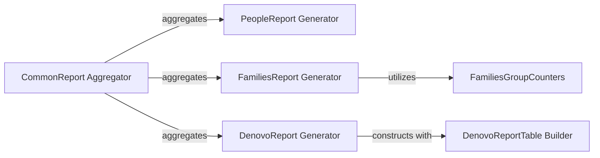

## Details

The `Common Reports Generation` component is a crucial part of the Bioinformatics Data Platform, providing standardized and frequently requested summaries from integrated genomic and phenotype data. It acts as the primary interface for users to quickly access insights into loaded studies, supporting quality control and initial data exploration.

### CommonReport Aggregator
This is the top-level component responsible for orchestrating and aggregating all common reports. It acts as a unified container for `PeopleReport`, `FamiliesReport`, and `DenovoReport`, ensuring a consistent structure for report generation and consumption. It also handles the serialization and deserialization of the complete common report, facilitating storage and retrieval.

**Related Classes/Methods**:

- `CommonReport Aggregator` (1:1)

### PeopleReport Generator
Focuses on generating statistical summaries and counts related to individuals (people) within a genomic study. It processes `PersonSetCollection` objects to produce `PeopleCounters`, offering insights into the demographic and phenotypic distribution of individuals in the dataset.

**Related Classes/Methods**:

- `PeopleReport Generator` (1:1)

### FamiliesReport Generator
Compiles and presents statistics and reports on family structures within the genomic data. It leverages `FamiliesGroupCounters` to aggregate family data based on various criteria, including pedigree information and family tags, providing an overview of family relationships and sizes.

**Related Classes/Methods**:

- `FamiliesReport Generator` (1:1)

### FamiliesGroupCounters
This component performs the core aggregation and counting logic specifically for families. It groups families based on predefined types and generates pedigree representations, serving as the engine for the `FamiliesReport Generator`.

**Related Classes/Methods**:

- `FamiliesGroupCounters` (1:1)

### DenovoReport Generator
Specializes in generating detailed reports on *de novo* genetic variants. It queries genotype data to identify and summarize *de novo* variants, constructing structured tables based on variant effect groups and types. This component is essential for identifying novel mutations.

**Related Classes/Methods**:

- `DenovoReport Generator` (1:1)

### DenovoReportTable Builder
Represents and constructs a single table within a *de novo* report. It organizes variant effect data by person sets and effect types, processing raw variant data to populate its rows (`EffectRow`) and individual cells (`EffectCell`) with counts of observed *de novo* events and affected individuals.

**Related Classes/Methods**:

- `DenovoReportTable Builder` (1:1)

### [FAQ](https://github.com/CodeBoarding/GeneratedOnBoardings/tree/main?tab=readme-ov-file#faq)