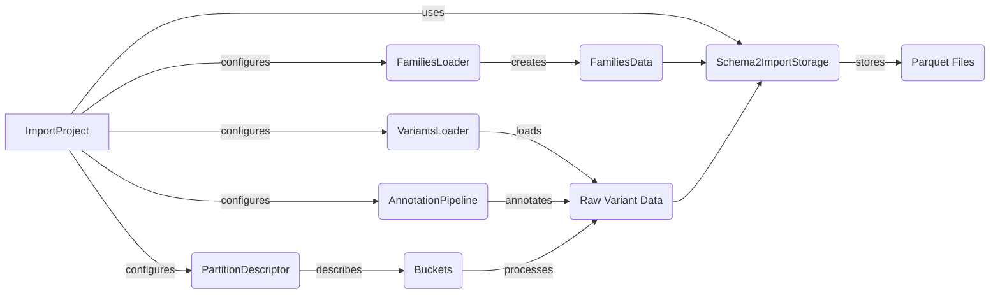

## Data Import & Conversion Component Overview

This component orchestrates the import and conversion of raw variant data into a standardized format suitable for GPF analysis. It involves reading data from various file formats, loading pedigree information, annotating variants, and storing the data in a parquet format according to a defined schema and partitioning strategy.

### Component Descriptions:

-   **ImportProject**: This component serves as the central configuration point for the entire import process. It reads and validates the import configuration, manages the creation of other components, and orchestrates the data flow. It interacts with `FamiliesLoader`, `VariantsLoader`, `AnnotationPipeline`, `PartitionDescriptor`, and `Schema2ImportStorage` to perform the import.
    *Relevant source files*: `dae/import_tools/import_tools.py`

-   **FamiliesLoader**: Responsible for loading pedigree data from a specified file and creating a `FamiliesData` object. It is configured by `ImportProject` and provides pedigree information to `VariantsLoader` and `Schema2ImportStorage`.
    *Relevant source files*: `dae/pedigrees/loader.py`

-   **VariantsLoader**: This component handles the loading of raw variant data from various file formats (VCF, DAE, etc.). It is configured by `ImportProject` and uses the `FamiliesData` object from `FamiliesLoader`. It provides an iterator of variants to `Schema2ImportStorage` for storage.
    *Relevant source files*: `dae/variants_loaders/raw/loader.py`

-   **AnnotationPipeline**: Responsible for annotating the variants with additional information. It is configured by `ImportProject` and annotates the raw variant data before it is stored by `Schema2ImportStorage`.
    *Relevant source files*: `dae/annotation/annotation_factory.py`

-   **PartitionDescriptor**: Defines how the data is partitioned in the storage. It is configured by `ImportProject` and used by `Schema2ImportStorage` to determine the partitioning scheme for the parquet files.
    *Relevant source files*: `dae/parquet/partition_descriptor.py`

-   **Schema2ImportStorage**: Handles the storage of the imported data in parquet files using the Schema2 storage format. It receives data from `FamiliesLoader`, `VariantsLoader`, and `AnnotationPipeline`, and uses the `PartitionDescriptor` to partition the data. It also uses `TaskGraph` to manage the import tasks.
    *Relevant source files*: `dae/schema2_storage/schema2_import_storage.py`

-   **FamiliesData**: Represents the loaded pedigree data. It is created by `FamiliesLoader` and used by `VariantsLoader` and `Schema2ImportStorage`.

-   **Raw Variant Data**: Represents the raw variant data loaded from the input files. It is loaded by `VariantsLoader` and annotated by `AnnotationPipeline` before being stored by `Schema2ImportStorage`.

-   **Buckets**: Represents a region of the input used for processing. It is configured by `ImportProject` and used by `VariantsLoader` to load data from specific regions.
    *Relevant source files*: `dae/import_tools/import_tools.py`

-   **Parquet Files**: Represents the final storage format for the imported data. They are created by `Schema2ImportStorage` and stored according to the partitioning scheme defined by `PartitionDescriptor`.
