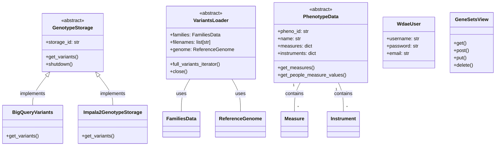

Based on the provided information, the `Data Management and Access` component is central to the project. It handles the storage, retrieval, and transformation of various data types, including genomic variants, phenotype data, gene sets, and user-related information.

**Component Description:**

The `Data Management and Access` component acts as a unified interface for interacting with different data sources within the system. It ensures data consistency and integrity while providing access to genomic variants, phenotype data, gene sets, and user information. This component abstracts away the complexities of the underlying storage mechanisms, allowing other components to focus on their specific tasks without needing to know the details of how the data is stored or retrieved.

**Main Classes and Their Purposes:**

1.  **`dae.genotype_storage.genotype_storage.GenotypeStorage`**: An abstract class that serves as the base for all genotype storage implementations. It defines the interface for storing and retrieving genomic variant data. Different implementations, such as `Impala2GenotypeStorage` and `GcpGenotypeStorage`, provide concrete ways to interact with specific storage systems.
2.  **`dae.variants_loaders.raw.loader.VariantsLoader`**: An abstract class responsible for loading variant data from various file formats (e.g., VCF, Parquet). It handles the parsing and transformation of raw data into a format suitable for storage and analysis within the system.
3.  **`dae.pheno.pheno_data.PhenotypeData`**: An abstract class that provides access to phenotype data associated with individuals and families. It defines methods for retrieving and analyzing phenotype information, such as measures, instruments, and regressions.
4.  **`users_api.models.WdaeUser`**: Django model representing a user in the system. It stores user-related information, such as username, password, and permissions.
5.  **`gene_sets.views.GeneSetsView`**: Django view that handles requests related to gene sets. It provides endpoints for retrieving, creating, and updating gene sets.
6.  **`gcp_storage.bigquery_variants.BigQueryVariants`**: A concrete implementation of `GenotypeStorage` that uses Google BigQuery for storing and querying genomic variant data.
7.  **`impala2_storage.schema2.impala2_genotype_storage.Impala2GenotypeStorage`**: A concrete implementation of `GenotypeStorage` that uses Impala and HDFS for storing and querying genomic variant data.

**Visualization:**

A class diagram is suitable for representing the structure of this component, highlighting the relationships between the main classes and their methods.

