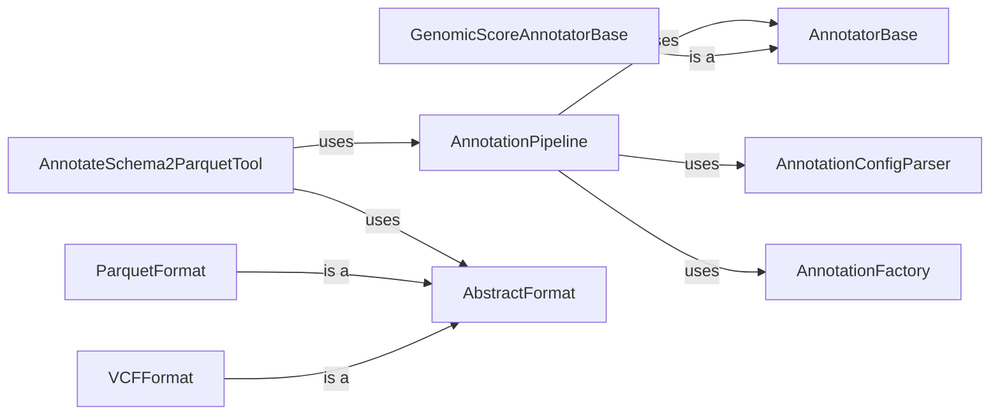

## Component Details

The Data Processing and Annotation component enriches genomic variant data with relevant annotations for downstream analysis. It orchestrates the process of reading variant data from various formats, applying a series of annotators to add information such as genomic scores, functional effects, and allele frequencies, and then writing the annotated data to a specified output format. The core of this process is managed by the AnnotationPipeline, which sequences the execution of individual annotators. The system supports configurable annotation pipelines, allowing users to define the specific annotations to be added and the order in which they are applied. The component also handles the conversion of genomic coordinates between different genome builds and normalization of alleles.

### AnnotateSchema2ParquetTool
This class serves as the entry point for the annotation process. It parses command-line arguments, prepares the data for annotation, orchestrates the execution of the annotation pipeline, and manages the output of the annotated data in Parquet format. It acts as the main driver for the entire annotation workflow.
- **Related Classes/Methods**: `gpf.dae.dae.annotation.annotate_schema2_parquet.AnnotateSchema2ParquetTool`

### AnnotationPipeline
The AnnotationPipeline class manages the sequence of annotators and applies them to the input data in batches. It defines the order in which annotators are executed and handles the overall flow of data through the annotation process. It relies on the AnnotationFactory to create annotator instances and the AnnotationConfigParser to parse the pipeline configuration.
- **Related Classes/Methods**: `gpf.dae.dae.annotation.annotation_pipeline.AnnotationPipeline`

### AnnotatorBase
AnnotatorBase is an abstract base class that defines the common interface for all annotators. It provides methods for opening, annotating, and closing the annotator. Concrete annotators inherit from this class and implement the specific annotation logic.
- **Related Classes/Methods**: `gpf.dae.dae.annotation.annotator_base.AnnotatorBase`

### GenomicScoreAnnotatorBase
GenomicScoreAnnotatorBase is a base class for annotators that use genomic scores. It provides common functionality for score aggregation and documentation. It simplifies the creation of annotators that rely on genomic scores.
- **Related Classes/Methods**: `gpf.dae.dae.annotation.score_annotator.GenomicScoreAnnotatorBase`

### AnnotationConfigParser
The AnnotationConfigParser is responsible for parsing annotation pipeline configurations from files or strings. It reads the configuration and creates the annotation pipeline, defining the sequence of annotators and their parameters.
- **Related Classes/Methods**: `gpf.dae.dae.annotation.annotation_config.AnnotationConfigParser`

### AbstractFormat
AbstractFormat defines the interface for handling different input and output file formats. It provides methods for opening, closing, processing, and batch processing data. It provides a common interface for reading and writing data in different formats.
- **Related Classes/Methods**: `gpf.dae.dae.annotation.format_handlers.AbstractFormat`

### ParquetFormat
ParquetFormat implements the AbstractFormat interface for reading and writing data in Parquet format. It handles the specifics of reading and writing Parquet files.
- **Related Classes/Methods**: `gpf.dae.dae.annotation.format_handlers.ParquetFormat`

### VCFFormat
VCFFormat implements the AbstractFormat interface for reading and writing data in VCF format. It handles the specifics of reading and writing VCF files.
- **Related Classes/Methods**: `gpf.dae.dae.annotation.format_handlers.VCFFormat`

### AnnotationFactory
The AnnotationFactory is responsible for creating annotator instances based on configuration. It instantiates the appropriate annotator classes based on the configuration.
- **Related Classes/Methods**: `gpf.dae.dae.annotation.annotation_factory`
