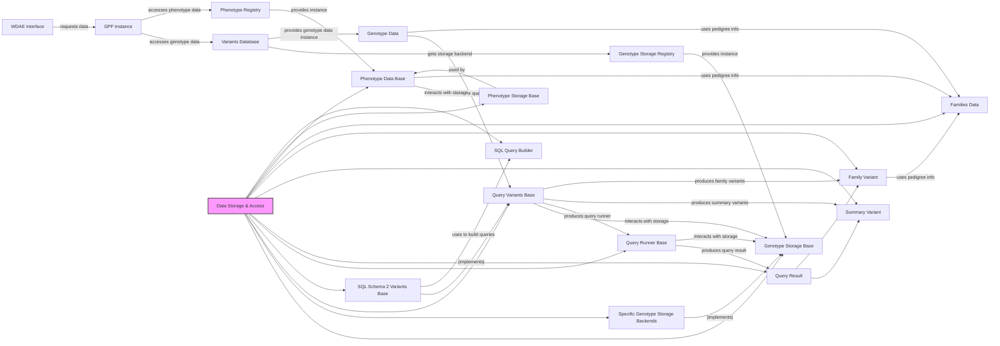

## Component Overview: Data Storage & Access

The `Data Storage & Access` component is responsible for the persistence, retrieval, and querying of genotype and phenotype data within the GPF system. It provides the necessary interfaces and abstractions to interact with various storage backends and retrieve variant and family data, as well as phenotype information.

### Component Descriptions:

*   **Genotype Storage Base**: An abstract base class defining the interface for different genotype storage backends. Concrete implementations interact with the underlying storage system and are used by Query Variants Base implementations. Relevant source file: `dae/genotype_storage/genotype_storage.py`.

*   **Specific Genotype Storage Backends**: Concrete implementations for storing and querying genotype data using various technologies like in-memory, Parquet, DuckDB, Impala, and BigQuery. These implement the `Genotype Storage Base` interface and interact with the underlying storage systems. Relevant source files: `dae/inmemory_storage/raw_variants.py`, `gcp_storage/bigquery_variants.py`, `impala_storage/schema1/impala_variants.py`, `impala2_storage/schema2/impala_variants.py`, `dae/parquet_storage/storage.py`, `dae/duckdb_storage/duckdb2_variants.py`.

*   **Query Variants Base**: An abstract base class for defining methods to query genetic variants. Implementations interact with `Genotype Storage Base` implementations to retrieve data and produce `Query Runner Base` instances. Relevant source file: `dae/query_variants/base_query_variants.py`.

*   **SQL Schema 2 Variants Base**: A concrete implementation of `Query Variants Base` for querying variants stored in SQL databases using Schema 2. It interacts with SQL databases via a `Genotype Storage Base` implementation, building `Query Runner Base` instances using `SQL Query Builder`. Relevant source file: `dae/query_variants/sql/schema2/base_variants.py`.

*   **Query Runner Base**: An abstract base class for executing variant queries and managing their results asynchronously. It interacts with the storage backend via a `Query Variants Base` implementation and produces a `Query Result`. Relevant source file: `dae/query_variants/query_runners.py`.

*   **Query Result**: Represents the result of a variant query, allowing iteration over returned variants. It provides access to `Family Variant` and `Summary Variant` instances. Relevant source file: `dae/query_variants/query_runners.py`.

*   **Summary Variant**: Represents a summary of a genetic variant across all families in a study. It is created by `Query Variants Base` implementations or Variants Loader Base. Relevant source file: `dae/variants/variant.py`.

*   **Family Variant**: Represents a genetic variant within a specific family, including genotype and inheritance information. It is created by `Query Variants Base` implementations or Variants Loader Base and uses `Families Data`. Relevant source file: `dae/variants/family_variant.py`.

*   **Families Data**: Represents the loaded and structured family and pedigree information. It is used by `Genotype Data`, `Family Variant`, and `Phenotype Data Base`. Relevant source file: `dae/pedigrees/families_data.py`.

*   **Phenotype Data Base**: An abstract base class for accessing and managing phenotype data associated with individuals in studies. Concrete implementations interact with `Phenotype Storage Base` and are used by the Phenotype Registry and GPF Instance. Relevant source file: `dae/pheno/pheno_data.py`.

*   **Phenotype Storage Base**: An abstract base class defining the interface for different phenotype data storage backends. Concrete implementations interact with the actual storage system and are used by `Phenotype Data Base` implementations. Relevant source file: `dae/pheno/storage.py`.

*   **SQL Query Builder**: Responsible for constructing SQL queries based on the provided query parameters and the database schema. It is used by `SQL Schema 2 Variants Base` to generate the actual SQL statements executed against the storage backend. Relevant source file: `dae/query_variants/sql/schema2/sql_query_builder.py`.
