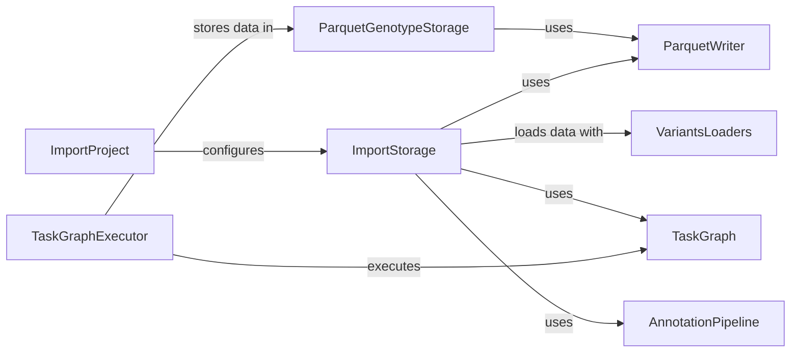

## Component Details

The Data Storage and Import component is responsible for importing genomic data from various formats into a genotype storage system. It orchestrates the data loading, transformation, and storage processes, supporting different storage backends like Impala, GCP, and DuckDB. The component builds import pipelines, manages data partitions, and writes data to Parquet files, ensuring efficient storage and organization of genomic data for downstream analysis.

### ImportProject
Represents an import project, providing a high-level interface for managing the import process. It encapsulates the configuration and metadata associated with the import task, including the storage configuration and variant loader settings. It serves as the entry point for initiating the data import process.
- **Related Classes/Methods**: `gpf.dae.dae.import_tools.import_tools.ImportProject`

### ParquetGenotypeStorage
Handles the storage of genotype data in Parquet format. It provides methods for importing datasets and interacting with the Parquet storage backend. It manages the creation of Parquet files and the organization of data within the storage. It is responsible for writing the data to disk in Parquet format.
- **Related Classes/Methods**: `gpf.dae.dae.parquet_storage.storage.ParquetGenotypeStorage`

### ParquetWriter
Provides utility functions for writing data to Parquet files, including pedigree data and variant data. It also handles schema serialization and merging of Parquet files. It is used by the storage implementations to write the data to disk.
- **Related Classes/Methods**: `gpf.dae.dae.parquet.parquet_writer`

### ImportStorage
Abstract base class for import storage implementations like Schema2, Impala, GCP, and DuckDB. It defines the common interface for writing pedigree, meta, and variant data to the respective storage backends. It provides a consistent way to interact with different storage systems.
- **Related Classes/Methods**: `gpf.dae.dae.schema2_storage.schema2_import_storage.Schema2ImportStorage`, `gpf.impala_storage.impala_storage.schema1.impala_schema1.ImpalaSchema1ImportStorage`, `gpf.gcp_storage.gcp_storage.gcp_import_storage.GcpImportStorage`, `gpf.dae.dae.duckdb_storage.duckdb_import_storage`

### VariantsLoaders
A collection of classes responsible for loading variant data from different file formats, such as VCF and DAE. These loaders parse the input files and convert the data into a standardized format for further processing. They provide a common interface for accessing variant data from different sources.
- **Related Classes/Methods**: `gpf.dae.dae.variants_loaders`

### TaskGraph
Represents a task graph that defines the data processing pipeline. It provides methods for creating tasks, pruning the graph, and executing the tasks in parallel. It allows for efficient and parallel processing of the data import tasks.
- **Related Classes/Methods**: `gpf.dae.dae.task_graph.graph.TaskGraph`

### TaskGraphExecutor
Executes the tasks defined in the task graph. It manages the execution order and resource allocation for the tasks. It ensures that the tasks are executed in the correct order and with the appropriate resources.
- **Related Classes/Methods**: `gpf.dae.dae.task_graph.executor.TaskGraphExecutor`

### AnnotationPipeline
Performs annotation of variants using a configurable pipeline. It provides methods for annotating individual variants or batches of variants. It enriches the variant data with additional information from various sources.
- **Related Classes/Methods**: `gpf.dae.dae.annotation.annotation_pipeline.AnnotationPipeline`
