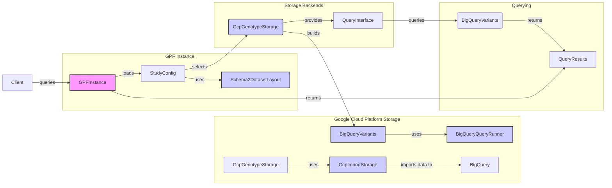

### Component Descriptions:

*   **GPFInstance:** Represents the overall GPF instance, managing access to genomic resources and data. It loads the study configurations and selects the appropriate genotype storage. It receives queries from the client and returns query results.
    *   Relevant source files: `dae/gpf_instance/gpf_instance.py`

*   **StudyConfig:** Contains the configuration for a specific study, including the dataset layout and storage backend. It uses the Schema2DatasetLayout to understand the data structure and selects the appropriate GenotypeStorage based on the configuration.
    *   Relevant source files:  `dae/configuration/study_config_builder.py`

*   **Schema2DatasetLayout:** Defines the layout of a dataset in Schema2 format, specifying the structure and organization of the data. It is used by the StudyConfig to understand the data structure.
    *   Relevant source files: `dae/schema2_storage/schema2_layout.py`

*   **GenotypeStorage:** An abstract component representing the storage backend for genotype data. It provides a query interface for accessing variant data. GcpGenotypeStorage is one implementation of this component.
    *   Relevant source files: `dae/genotype_storage/genotype_storage.py`

*   **GcpGenotypeStorage:** Manages genotype data stored in Google Cloud Platform (GCP). It builds BigQueryVariants for querying and uses GcpImportStorage for importing data.
    *   Relevant source files: `gcp_storage/gcp_genotype_storage.py`

*   **BigQueryVariants:** Represents variant data stored in BigQuery. It uses BigQueryQueryRunner to execute queries and returns query results.
    *   Relevant source files: `gcp_storage/bigquery_variants.py`

*   **BigQueryQueryRunner:** Executes queries against BigQuery. It is used by BigQueryVariants to retrieve data.
    *   Relevant source files: `gcp_storage/bigquery_query_runner.py`

*   **GcpImportStorage:** Handles importing datasets into GCP. It imports data to BigQuery.
    *   Relevant source files: `gcp_storage/gcp_import_storage.py`

*   **QueryInterface:** Provides an abstract interface for querying variants. It queries the VariantsData and returns query results.
    *   Relevant source files: `dae/query_variants/query_variants.py`

*   **VariantsData:** Represents the actual variant data. BigQueryVariants is one implementation of this component. It returns query results to the QueryInterface.
    *   Relevant source files: `dae/variants_db/variants_db.py`

*   **QueryResults:** Represents the results of a query. It is returned to the GPFInstance and then to the client.
    *   Relevant source files: `dae/query_variants/query_results.py`

*   **Client:** The user or application that initiates queries. It queries the GPFInstance and receives query results.
