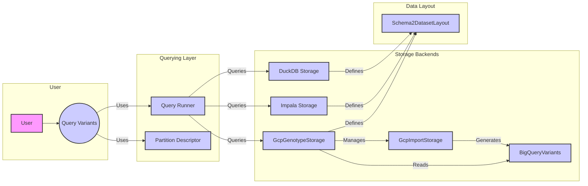

## Data Storage and Querying Overview

This section provides an overview of the data storage and querying subsystem, focusing on its architecture, key components, and data flow. The system is designed to handle variant data, supporting multiple storage backends and providing a unified interface for querying.

### Data Flow Diagram

### Component Descriptions

*   **Query Variants (Q):** An abstract interface for querying variants, providing methods to build and execute queries against different storage backends. It uses a `QueryRunner` to execute the query and a `PartitionDescriptor` to understand data partitioning.
    *   **Relevant source files:** `dae.query_variants`
*   **Query Runner (QR):** Executes queries against the storage backend. It receives a query from `Query Variants`, executes it, and returns the results.
    *   **Relevant source files:** `dae.query_variants.query_runners`
*   **GcpGenotypeStorage (GS):** Manages genotype data stored in Google Cloud Platform (GCP), handling import, storage, and querying using BigQuery. It defines the `Schema2DatasetLayout` and uses `GcpImportStorage` to import data.
    *   **Relevant source files:** `repos.gpf.gcp_storage.gcp_storage.gcp_genotype_storage.GcpGenotypeStorage`
*   **Impala Storage (IS):** Manages genotype data stored in Impala. It defines the `Schema2DatasetLayout`.
    *   **Relevant source files:** `dae.impala_storage`
*   **DuckDB Storage (DS):** Manages genotype data stored in DuckDB. It defines the `Schema2DatasetLayout`.
    *   **Relevant source files:** `dae.duckdb_storage`
*   **BigQueryVariants (BQ):** Represents variant data stored in BigQuery, providing methods for deserializing and querying variants. It is managed by `GcpGenotypeStorage` and its data is generated by `GcpImportStorage`.
    *   **Relevant source files:** `repos.gpf.gcp_storage.gcp_storage.bigquery_variants.BigQueryVariants`
*   **GcpImportStorage (GI):** Handles the import process of datasets into GCP, generating task graphs for importing data and managing study configurations. It is managed by `GcpGenotypeStorage` and generates data for `BigQueryVariants`.
    *   **Relevant source files:** `repos.gpf.gcp_storage.gcp_storage.gcp_import_storage.GcpImportStorage`
*   **Schema2DatasetLayout (SDL):** Represents the layout of a dataset in schema2 format, defining the structure and organization of data tables (pedigree, summary, family, meta). It is defined by all storage backends.
    *   **Relevant source files:** `dae.schema2_storage.schema2_layout.Schema2DatasetLayout`
*   **Partition Descriptor (PD):** Describes how a dataset is partitioned, enabling efficient querying and storage based on data characteristics like region, frequency, coding effect, and family. It is used by the `Query Variants` to optimize queries.
    *   **Relevant source files:** `dae.parquet.partition_descriptor.PartitionDescriptor`
