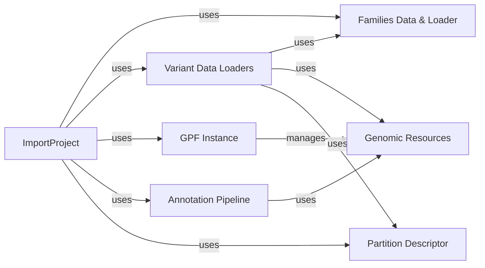

## Component Details

This subsystem is responsible for the end-to-end process of bringing raw genetic and pedigree data into the GPF system, transforming it into optimized storage formats, and enriching it with functional and clinical annotations. It acts as the gateway for new datasets, ensuring data quality, consistency, and biological relevance for subsequent analysis.

### ImportProject
The central orchestrator of the data ingestion and annotation process. It reads and validates import configurations, initializes all necessary data loaders (for pedigree and variant data), configures the annotation pipeline, and manages the overall workflow of data transformation into optimized storage formats. It acts as the primary interface for defining and executing a data import.

**Related Classes/Methods**:

- <a href="https://github.com/iossifovlab/gpf/blob/master/dae/dae/import_tools/import_tools.py#L0-L0" target="_blank" rel="noopener noreferrer">`gpf.dae.dae.import_tools.import_tools` (0:0)</a>

### Variant Data Loaders
A collection of specialized components responsible for reading, parsing, and standardizing genetic variant data from diverse raw input formats (e.g., VCF, Parquet). Each loader handles the specific nuances of its respective file format, ensuring data integrity and consistency before further processing. They provide an iterable interface for variant records.

**Related Classes/Methods**:

- <a href="https://github.com/iossifovlab/gpf/blob/master/dae/dae/variants_loaders/vcf/loader.py#L0-L0" target="_blank" rel="noopener noreferrer">`gpf.dae.dae.variants_loaders.vcf.loader` (0:0)</a>
- <a href="https://github.com/iossifovlab/gpf/blob/master/dae/dae/variants_loaders/parquet/loader.py#L0-L0" target="_blank" rel="noopener noreferrer">`gpf.dae.dae.variants_loaders.parquet.loader` (0:0)</a>
- <a href="https://github.com/iossifovlab/gpf/blob/master/dae/dae/variants_loaders/cnv/loader.py#L0-L0" target="_blank" rel="noopener noreferrer">`gpf.dae.dae.variants_loaders.cnv.loader` (0:0)</a>
- <a href="https://github.com/iossifovlab/gpf/blob/master/dae/dae/variants_loaders/dae/loader.py#L0-L0" target="_blank" rel="noopener noreferrer">`gpf.dae.dae.variants_loaders.dae.loader` (0:0)</a>
- <a href="https://github.com/iossifovlab/gpf/blob/master/dae/dae/variants_loaders/raw/loader.py#L0-L0" target="_blank" rel="noopener noreferrer">`gpf.dae.dae.variants_loaders.raw.loader` (0:0)</a>

### Families Data & Loader
This component is responsible for loading, parsing, and representing pedigree (family) information. `FamiliesLoader` reads pedigree files and constructs `FamiliesData` objects, which encapsulate the relationships between individuals. Accurate family data is crucial for genetic analysis, especially for determining inheritance patterns and is utilized by variant loaders.

**Related Classes/Methods**:

- <a href="https://github.com/iossifovlab/gpf/blob/master/dae/dae/pedigrees/families_data.py#L0-L0" target="_blank" rel="noopener noreferrer">`gpf.dae.dae.pedigrees.families_data` (0:0)</a>
- `gpf.dae.dae.pedigrees.families_loader` (0:0)

### Annotation Pipeline
This component defines and executes a sequence of annotation steps. It integrates various `Annotator` modules that enrich genetic variants with functional, clinical, and other relevant biological information by leveraging diverse genomic resources. It provides methods for both single and batch annotation.

**Related Classes/Methods**:

- <a href="https://github.com/iossifovlab/gpf/blob/master/dae/dae/annotation/annotation_pipeline.py#L0-L0" target="_blank" rel="noopener noreferrer">`gpf.dae.dae.annotation.annotation_pipeline` (0:0)</a>

### Genomic Resources
These components provide access to and manage foundational genomic reference data. `ReferenceGenome` offers access to nucleotide sequences and chromosome information, while `GeneModels` provides gene and transcript structure data. `GenomicContext` acts as a unified interface to access these and other genomic resources, crucial for accurate variant annotation.

**Related Classes/Methods**:

- <a href="https://github.com/iossifovlab/gpf/blob/master/dae/dae/genomic_resources/reference_genome.py#L0-L0" target="_blank" rel="noopener noreferrer">`gpf.dae.dae.genomic_resources.reference_genome` (0:0)</a>
- <a href="https://github.com/iossifovlab/gpf/blob/master/dae/dae/genomic_resources/gene_models/gene_models.py#L0-L0" target="_blank" rel="noopener noreferrer">`gpf.dae.dae.genomic_resources.gene_models.gene_models` (0:0)</a>
- <a href="https://github.com/iossifovlab/gpf/blob/master/dae/dae/genomic_resources/genomic_context.py#L0-L0" target="_blank" rel="noopener noreferrer">`gpf.dae.dae.genomic_resources.genomic_context` (0:0)</a>

### GPF Instance
A core component of the broader GPF system, fundamental to data ingestion and annotation as it provides access to global configurations, registered genotype storages, and the Genomic Resource Repository (`GenomicResourceRepo`). These are critical dependencies for `ImportProject` and `AnnotationPipeline` to function within the GPF ecosystem.

**Related Classes/Methods**:

- `gpf.dadae.gpf_instance.gpf_instance` (0:0)

### Partition Descriptor
This component defines the partitioning strategy for the imported data, particularly for variants. It specifies how data should be organized into logical and physical partitions (e.g., by chromosome region, frequency) to optimize storage efficiency and query performance in the final Parquet datasets.

**Related Classes/Methods**:

- `gpf.dae.dae.parquet_storage.partition_descriptor` (0:0)

### [FAQ](https://github.com/CodeBoarding/GeneratedOnBoardings/tree/main?tab=readme-ov-file#faq)