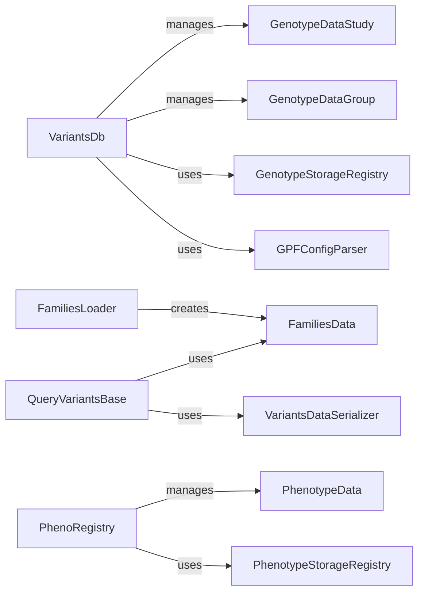

## Component Details

This subsystem is crucial for organizing, storing, and retrieving all core genomic data, including genotype studies, variants, pedigree information, and phenotype data. It provides a unified interface for querying these diverse datasets, abstracting the underlying storage mechanisms.

### VariantsDb
This component acts as the central repository for managing and accessing genotype data studies and groups. It is responsible for loading study and group configurations, interacting with `GenotypeStorageRegistry` to build genotype data backends, and caching loaded studies and groups. It provides methods to retrieve genotype studies and groups by their IDs.

**Related Classes/Methods**: _None_

### QueryVariantsBase
This is a foundational abstract class that defines the basic framework for querying and deserializing genetic variants, particularly for the Schema2 query interface. It handles the transformation of raw variant data into structured `SummaryVariant` and `FamilyVariant` objects, utilizing a `VariantsDataSerializer` and relying on `FamiliesData` for pedigree information.

**Related Classes/Methods**: _None_

### FamiliesLoader
This component is dedicated to the loading, parsing, and structuring of pedigree information. It supports various pedigree file formats and transforms them into a standardized `FamiliesData` object, ensuring that family relationships and individual roles are accurately represented.

**Related Classes/Methods**: _None_

### PhenoRegistry
Similar to `VariantsDb` but for phenotype data, this registry manages and provides access to phenotype datasets. It handles the loading and caching of phenotype study and group instances, abstracting the underlying phenotype storage mechanisms and relying on a `PhenotypeStorageRegistry`.

**Related Classes/Methods**: _None_

### PhenotypeData
This represents the core data model for a loaded phenotype dataset. It provides the necessary interface to access and query phenotype measures and individual-level data, serving as the raw material for any phenotype-related analysis or display.

**Related Classes/Methods**: _None_

### [FAQ](https://github.com/CodeBoarding/GeneratedOnBoardings/tree/main?tab=readme-ov-file#faq)