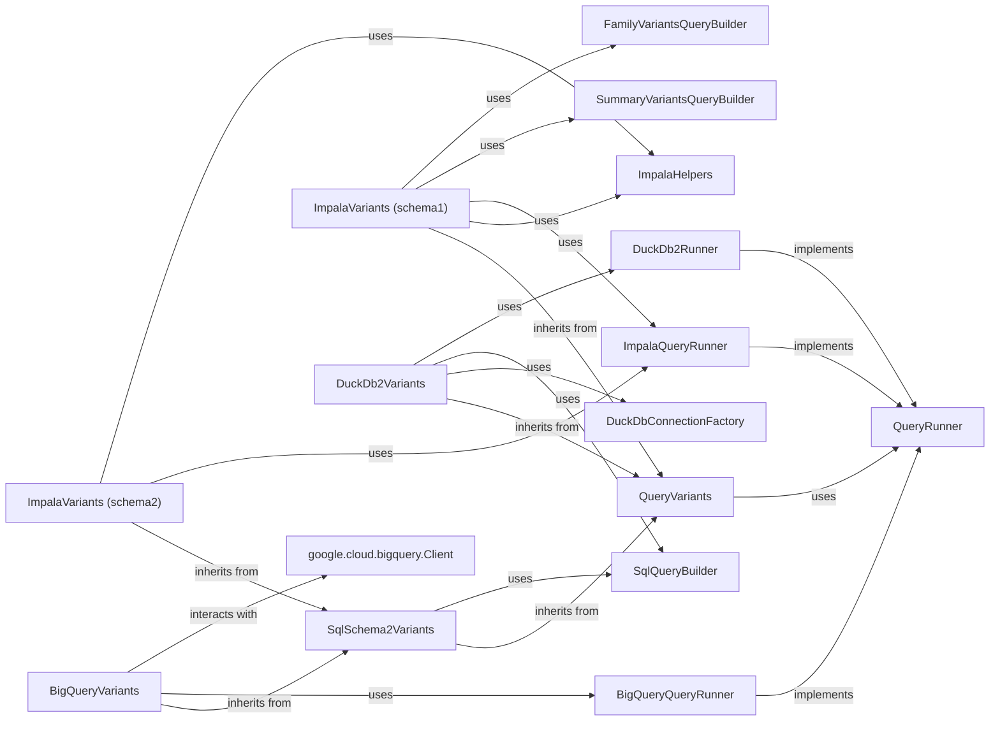

## Component Details

The Data Persistence Layer is a critical subsystem responsible for managing and abstracting various storage technologies for genomic and phenotypic data. It provides a unified interface for querying and retrieving data, ensuring efficiency, scalability, and data integrity across different backends like Google BigQuery, Impala, and DuckDB.

### QueryVariants
This is the foundational abstract base class for all variant querying implementations. It establishes a common interface and provides core functionalities such as deserializing variant data from raw blobs into structured SummaryVariant and FamilyVariant objects. It ensures consistency across diverse storage backends.

**Related Classes/Methods**:

- `QueryVariants` (1:1)

### SqlSchema2Variants
An abstract base class specifically tailored for variant storage implementations that interact with SQL databases adhering to schema2. It extends QueryVariants by introducing abstract methods for fetching database-specific schema, pedigree, and table properties, and for deserializing SQL records. This class significantly reduces redundancy for SQL-based backends by providing a common framework for query building and execution.

**Related Classes/Methods**:

- `SqlSchema2Variants` (1:1)

### BigQueryVariants
This concrete implementation serves as the interface for querying genetic variants stored in Google Cloud Platform's BigQuery. It translates generic variant queries into BigQuery-specific SQL, handles data retrieval using the bigquery.Client, and manages the deserialization of results.

**Related Classes/Methods**:

- `BigQueryVariants` (1:1)

### ImpalaVariants (schema1)
This component is responsible for querying variant data from Impala databases that follow an older schema (schema1). It includes specific logic for fetching pedigree and variant schemas, constructing queries, and handling data retrieval tailored for Impala's schema1.

**Related Classes/Methods**:

- <a href="https://github.com/iossifovlab/gpf/blob/master/impala_storage/impala_storage/schema1/impala_variants.py#L39-L570" target="_blank" rel="noopener noreferrer">`ImpalaVariants` (39:570)</a>

### ImpalaVariants (schema2)
This component provides the functionality for querying variant data from Impala databases that utilize a newer, standardized schema (schema2). It leverages the common SQL schema abstractions defined in SqlSchema2Variants to build and execute queries.

**Related Classes/Methods**:

- <a href="https://github.com/iossifovlab/gpf/blob/master/impala_storage/impala_storage/schema1/impala_variants.py#L39-L570" target="_blank" rel="noopener noreferrer">`ImpalaVariants` (39:570)</a>

### DuckDb2Variants
Implements variant querying capabilities for DuckDB, an in-process analytical database. This component is designed for efficient local data processing and integrates with the schema2 SQL query building mechanisms provided by SqlQueryBuilder.

**Related Classes/Methods**:

- `DuckDb2Variants` (1:1)

### QueryRunner
This is an abstract base class that defines the contract for executing queries and iterating over their results. Concrete implementations of this class handle the specifics of fetching data from various sources (e.g., Impala, DuckDB, BigQuery) and manage the lifecycle of query execution.

**Related Classes/Methods**:

- `QueryRunner` (1:1)

### SqlQueryBuilder
This component is responsible for dynamically constructing SQL queries for schema2 variant data. It translates high-level query parameters (e.g., regions, genes, effect types, filters) into precise SQL statements for both summary and family variants, leveraging the sqlglot library for SQL expression building. It also incorporates partitioning heuristics into the queries.

**Related Classes/Methods**:

- <a href="https://github.com/iossifovlab/gpf/blob/master/dae/dae/query_variants/sql/schema2/sql_query_builder.py#L469-L1287" target="_blank" rel="noopener noreferrer">`SqlQueryBuilder` (469:1287)</a>

### ImpalaHelpers
A utility component for managing Impala connections and related helper functions, used by both schema1 and schema2 Impala variant implementations.

**Related Classes/Methods**:

- <a href="https://github.com/iossifovlab/gpf/blob/master/impala_storage/impala_storage/helpers/impala_helpers.py#L17-L450" target="_blank" rel="noopener noreferrer">`ImpalaHelpers` (17:450)</a>

### DuckDbConnectionFactory
A factory for creating and managing connections to DuckDB databases, ensuring proper connection handling for DuckDb2Variants.

**Related Classes/Methods**:

- `DuckDbConnectionFactory` (1:1)

### BigQueryQueryRunner
A concrete implementation of the abstract QueryRunner interface for BigQuery.

**Related Classes/Methods**:

- `BigQueryQueryRunner` (1:1)

### ImpalaQueryRunner
A concrete implementation of the abstract QueryRunner interface for Impala.

**Related Classes/Methods**:

- <a href="https://github.com/iossifovlab/gpf/blob/master/impala_storage/impala_storage/helpers/impala_query_runner.py#L16-L161" target="_blank" rel="noopener noreferrer">`ImpalaQueryRunner` (16:161)</a>

### DuckDb2Runner
A concrete implementation of the abstract QueryRunner interface for DuckDB.

**Related Classes/Methods**:

- `DuckDb2Runner` (1:1)

### SummaryVariantsQueryBuilder
Component used by ImpalaVariants (schema1) to build queries for summary variants.

**Related Classes/Methods**:

- <a href="https://github.com/iossifovlab/gpf/blob/master/impala_storage/impala_storage/schema1/summary_variants_query_builder.py#L18-L192" target="_blank" rel="noopener noreferrer">`SummaryVariantsQueryBuilder` (18:192)</a>

### FamilyVariantsQueryBuilder
Component used by ImpalaVariants (schema1) to build queries for family variants.

**Related Classes/Methods**:

- <a href="https://github.com/iossifovlab/gpf/blob/master/impala_storage/impala_storage/schema1/family_variants_query_builder.py#L16-L236" target="_blank" rel="noopener noreferrer">`FamilyVariantsQueryBuilder` (16:236)</a>

### google.cloud.bigquery.Client
BigQuery client library for connecting and querying the BigQuery database.

**Related Classes/Methods**:

- `google.cloud.bigquery.Client` (1:1)

### [FAQ](https://github.com/CodeBoarding/GeneratedOnBoardings/tree/main?tab=readme-ov-file#faq)