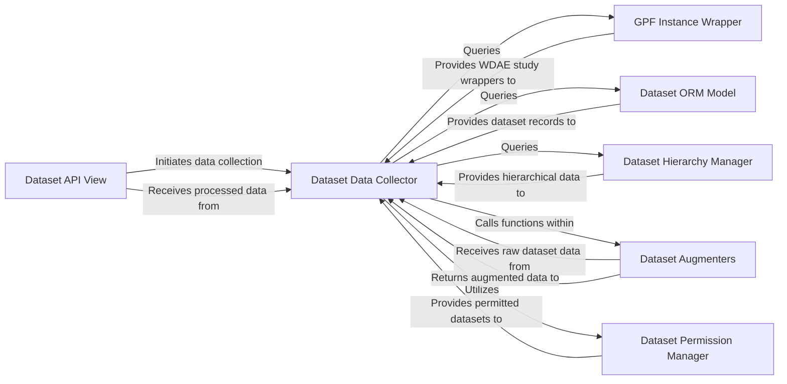

## Component Details

This analysis focuses on the `DatasetView` component, which serves as the API gateway for interacting with dataset metadata. It orchestrates the collection, augmentation, and presentation of dataset information to web clients. The identified components are fundamental because they collectively handle the entire lifecycle of a dataset API request, from initial data retrieval to final presentation, including crucial aspects like data access control and hierarchical relationships.

### Dataset API View
This component is the primary interface for web clients to interact with dataset metadata. It handles incoming GET requests for both summaries of all datasets and detailed information for individual datasets. It orchestrates the data collection, permission checking, and augmentation processes before presenting the final, enriched dataset information to the user.

**Related Classes/Methods**:

- `DatasetView` (1:1)

### GPF Instance Wrapper
This component acts as an adapter to the core GPF (Genotype-Phenotype Federation) instance. It provides methods to retrieve available data IDs and obtain `WDAEStudy` wrappers for specific datasets, abstracting the underlying GPF implementation details.

**Related Classes/Methods**:

- `self.gpf_instance` (1:1)

### Dataset Data Collector
This component is responsible for gathering raw dataset information. It iterates through available datasets, retrieves their `WDAEStudy` wrappers, and structures the initial data based on whether the dataset is a genotype or phenotype study. It also initiates the augmentation process by calling other components.

**Related Classes/Methods**:

- `_collect_datasets_summary` (1:1)
- `_collect_single_dataset` (1:1)

### Dataset ORM Model
This component represents the Django Object-Relational Mapping (ORM) model for datasets. It provides an interface to query and retrieve dataset records, including their associated user groups, directly from the database.

**Related Classes/Methods**:

- `Dataset.objects` (1:1)

### Dataset Hierarchy Manager
This component is specifically responsible for managing and providing information about the hierarchical relationships between datasets, such as identifying direct parent datasets. It interacts with the `Dataset` Django model to retrieve this information from the database.

**Related Classes/Methods**:

- `DatasetHierarchy` (1:1)

### Dataset Augmenters
This component consists of utility functions that enrich the basic dataset information with additional attributes. These augmentations include adding accessibility status based on user permissions, associating user groups with datasets, and incorporating parent dataset details.

**Related Classes/Methods**:

- `augment_accessibility` (1:1)
- `augment_with_groups` (1:1)
- `augment_with_parents` (1:1)

### Dataset Permission Manager
This component is responsible for determining which datasets a given user has permission to access. It interacts with the system's user and permission management to filter datasets based on access rights.

**Related Classes/Methods**:

- `get_permitted_datasets` (1:1)

### [FAQ](https://github.com/CodeBoarding/GeneratedOnBoardings/tree/main?tab=readme-ov-file#faq)