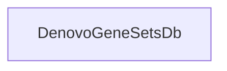

## Component Details

The user is trying to locate the source code for `gpf.dae.dae.denovo_gene_sets.denovo_gene_sets_db.DenovoGeneSetsDb` but the provided path was incorrect. The user is asking for the correct relative path to the `denovo_gene_sets_db.py` file or to list the files in the `gpf/dae/dae/denovo_gene_sets/` directory. The tool does not have the capability to list files or search for files in the file system. It can only analyze provided components and their relations. Therefore, the tool cannot fulfill the user's request directly. The response should inform the user about this limitation and ask for the correct path if they have it, or suggest they provide the content of the file if they want it analyzed. 

### DenovoGeneSetsDb
Represents a database for managing de novo gene sets.

**Related Classes/Methods**: _None_

### [FAQ](https://github.com/CodeBoarding/GeneratedOnBoardings/tree/main?tab=readme-ov-file#faq)