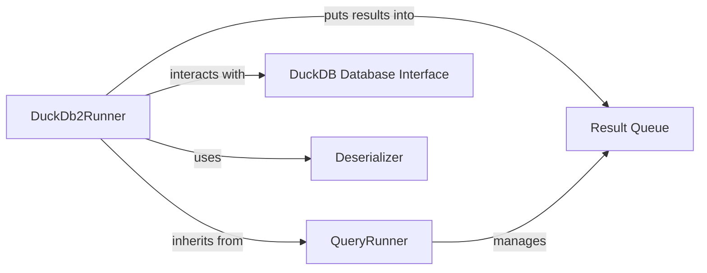

## Component Details

This analysis focuses on the `DuckDb2Runner` component, its role in the system, and its interactions with other key components.

### DuckDb2Runner
A concrete implementation of the `QueryRunner` abstract interface, specifically designed to execute SQL queries against a DuckDB database. It manages the direct connection to the DuckDB database, iterates through a list of provided SQL queries, executes them using a database cursor, and processes the fetched results by deserializing them and placing them into a result queue. It also handles termination conditions such as reaching a specified limit or being explicitly closed, and operates within its own thread for asynchronous execution.

**Related Classes/Methods**:

- <a href="https://github.com/iossifovlab/gpf/blob/master/dae/dae/duckdb_storage/duckdb2_variants.py#L1-L1" target="_blank" rel="noopener noreferrer">`gpf/dae/dae/duckdb_storage/duckdb2_variants.py` (1:1)</a>

### QueryRunner
This is an abstract base class that establishes the fundamental contract for any query execution runner within the system. It defines core lifecycle methods (`__init__`, `run` - abstract, `is_closed`, `put_value_in_result_queue`) and manages thread synchronization for status updates (e.g., `_status_lock`, `_closed`, `_started`, `_done`). It provides a mechanism to set a deserializer for processing query results and handles the queuing of these results.

**Related Classes/Methods**:

- <a href="https://github.com/iossifovlab/gpf/blob/master/dae/dae/query_variants/query_runners.py#L1-L1" target="_blank" rel="noopener noreferrer">`gpf/dae/dae/query_variants/query_runners.py` (1:1)</a>

### DuckDB Database Interface
This component represents the direct interaction layer with the external DuckDB database. It is responsible for establishing and managing the database connection (`duckdb.DuckDBPyConnection`) and providing the cursor for executing raw SQL queries and fetching results. This component is an external dependency that `DuckDb2Runner` relies on for its core functionality.

**Related Classes/Methods**: _None_

### Deserializer
An optional callable component passed to the `QueryRunner` (and thus `DuckDb2Runner`) that transforms raw database records (e.g., tuples from `cursor.fetchone()`) into a desired, structured data format before they are placed into the result queue.

**Related Classes/Methods**: _None_

### Result Queue
A thread-safe queue (likely an instance of `queue.Queue` or similar, managed by `QueryRunner`) used to store the processed and deserialized results of the executed queries. `DuckDb2Runner` puts values into this queue, which can then be consumed by other parts of the system.

**Related Classes/Methods**: _None_

### [FAQ](https://github.com/CodeBoarding/GeneratedOnBoardings/tree/main?tab=readme-ov-file#faq)