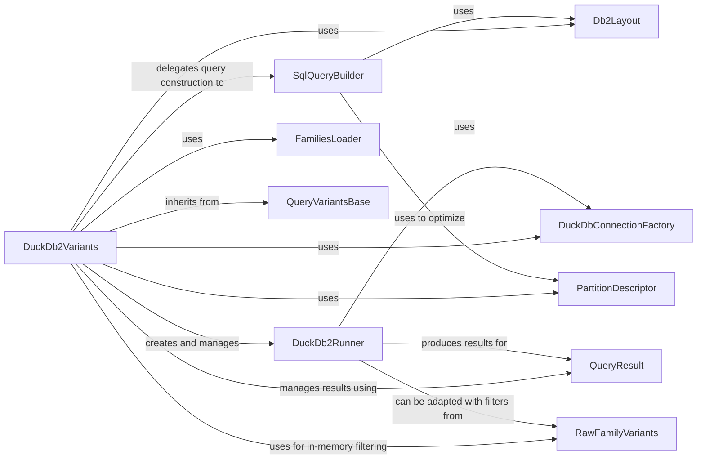

## Component Details

The DuckDb2Variants component is a crucial part of the system, acting as the primary interface for querying genetic variants stored in a DuckDB database. It orchestrates the entire query process, from database connection and schema interpretation to SQL query construction, execution, and result processing. Its fundamental nature stems from its role as the bridge between the high-level variant query requests and the underlying DuckDB storage.

### DuckDb2Variants
The central class of the subsystem, DuckDb2Variants serves as the main interface for querying genetic variants stored in a DuckDB database. It initializes database schemas, partition descriptors, and family data by interacting with DuckDbConnectionFactory, Db2Layout, PartitionDescriptor, and FamiliesLoader. It delegates SQL query construction to SqlQueryBuilder and uses DuckDb2Runner to execute these queries. It also applies in-memory filtering using RawFamilyVariants and manages query execution and result iteration through QueryResult. It inherits core functionalities from QueryVariantsBase.

**Related Classes/Methods**:

- `DuckDb2Variants` (1:1)

### DuckDbConnectionFactory
An abstract factory responsible for providing and managing connections to the DuckDB database. DuckDb2Variants uses this factory to obtain database cursors for executing queries and fetching metadata, ensuring proper database resource management.

**Related Classes/Methods**:

- `DuckDbConnectionFactory` (1:1)

### Db2Layout
Defines the logical and physical layout of the variant data within the DuckDB database. It specifies the names and locations of tables for metadata, pedigree information, summary variants, and family variants, enabling DuckDb2Variants and SqlQueryBuilder to correctly access the data.

**Related Classes/Methods**:

- `Db2Layout` (1:1)

### SqlQueryBuilder
A specialized component responsible for constructing optimized SQL queries for retrieving variant data from DuckDB. It translates high-level query parameters (e.g., regions, genes, effect types, family filters) into precise SQL statements, leveraging the database layout (Db2Layout), schema, and partitioning information (PartitionDescriptor).

**Related Classes/Methods**:

- <a href="https://github.com/iossifovlab/gpf/blob/master/dae/dae/query_variants/sql/schema2/sql_query_builder.py#L469-L1287" target="_blank" rel="noopener noreferrer">`SqlQueryBuilder` (469:1287)</a>

### DuckDb2Runner
An implementation of QueryRunner specifically designed for DuckDB. It executes the SQL queries generated by SqlQueryBuilder against the DuckDB database using a provided connection. It then uses a deserializer to convert the raw database results into structured variant objects and enqueues them for consumption by QueryResult.

**Related Classes/Methods**:

- `DuckDb2Runner` (1:1)

### QueryResult
A higher-level component that orchestrates and manages the execution and iteration of results from one or more QueryRunner instances (like DuckDb2Runner). It provides a unified, thread-safe interface for consuming query results, handling limits, and managing the lifecycle of the underlying query runners.

**Related Classes/Methods**:

- `QueryResult` (1:1)

### FamiliesLoader
A utility class responsible for loading and processing pedigree data, typically from a DataFrame or file. It transforms raw pedigree information into a structured FamiliesData object, which is essential for DuckDb2Variants to understand family relationships and perform family-based variant queries.

**Related Classes/Methods**:

- `FamiliesLoader` (1:1)

### PartitionDescriptor
Represents and manages the partitioning scheme of variant data within the storage. It defines how variants are organized into bins (e.g., by region, frequency, coding effect, or family) to optimize query performance. DuckDb2Variants loads this descriptor, and SqlQueryBuilder uses its information to construct efficient, partitioned SQL queries.

**Related Classes/Methods**:

- <a href="https://github.com/iossifovlab/gpf/blob/master/dae/dae/parquet/partition_descriptor.py#L29-L637" target="_blank" rel="noopener noreferrer">`PartitionDescriptor` (29:637)</a>

### QueryVariantsBase
The abstract base class that defines the common interface and foundational functionalities for all variant querying backends within the DAE framework. It handles basic variant deserialization and provides abstract methods for building and executing summary and family variant queries, which are implemented by concrete classes like DuckDb2Variants.

**Related Classes/Methods**:

- `QueryVariantsBase` (1:1)

### RawFamilyVariants
An abstract base class that provides static methods for generating in-memory filter functions for summary and family variants. These filters are applied after the initial database query by DuckDb2Runner, allowing for more complex or specific filtering criteria that might not be efficiently handled by SQL alone.

**Related Classes/Methods**:

- `RawFamilyVariants` (1:1)

### [FAQ](https://github.com/CodeBoarding/GeneratedOnBoardings/tree/main?tab=readme-ov-file#faq)