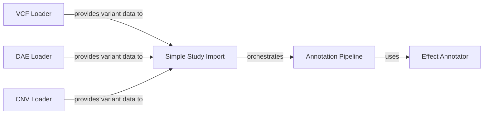

## Details

An expert analysis of the ETL Pipeline component within the GPF project, highlighting the modular and extensible architecture for processing genomic data. This analysis focuses on the core components responsible for data extraction, transformation, and loading, detailing their roles and interactions. The selected components are fundamental to the ETL pipeline's operation, each representing a critical function in the data processing workflow from data ingestion to processing and loading, reflecting the platform's focus on modularity, extensibility, and robust data processing capabilities.

### VCF Loader
Responsible for parsing and loading data from Variant Call Format (VCF) files. It handles the complexities of the VCF format, including genotype information, INFO fields, and header parsing, to extract variant data for downstream processing.

**Related Classes/Methods**:

- `gpf.dae.dae.variants_loaders.vcf.loader.py`

### DAE Loader
Handles the loading of data from the native DAE (Data Access Engine) format. This loader is optimized for GPF's internal data representation, enabling efficient data ingestion from pre-processed files.

**Related Classes/Methods**:

- `gpf.dae.dae.variants_loaders.dae.loader.py`

### CNV Loader
Specialized for loading Copy Number Variation (CNV) data. It processes files containing CNV calls, which represent large-scale structural variations in the genome, and prepares them for annotation and analysis.

**Related Classes/Methods**:

- `gpf.dae.dae.variants_loaders.cnv.loader.py`

### Annotation Pipeline
The core of the "Transform" stage, this component orchestrates a series of annotators to enrich variant data. It is highly configurable, allowing for the dynamic chaining of different annotation steps, such as adding gene information, functional scores, and effect predictions.

**Related Classes/Methods**:

- `gpf.dae.dae.annotation.annotation_pipeline.py`

### Effect Annotator
A key annotator within the pipeline that determines the effects of variants on gene function. It uses a gene model to predict consequences such as missense, nonsense, or synonymous mutations, which are critical for interpreting the functional impact of genetic variations.

**Related Classes/Methods**:

- `gpf.dae.dae.annotation.effect_annotator.py`

### Simple Study Import
A command-line tool that orchestrates the entire ETL process for a single study. It utilizes the appropriate data loader to ingest raw data, passes it through the annotation pipeline for enrichment, and finally loads the processed data into the GPF database, making it available for query and analysis.

**Related Classes/Methods**:

- `gpf.dae.tools.simple_study_import.py`

### [FAQ](https://github.com/CodeBoarding/GeneratedOnBoardings/tree/main?tab=readme-ov-file#faq)