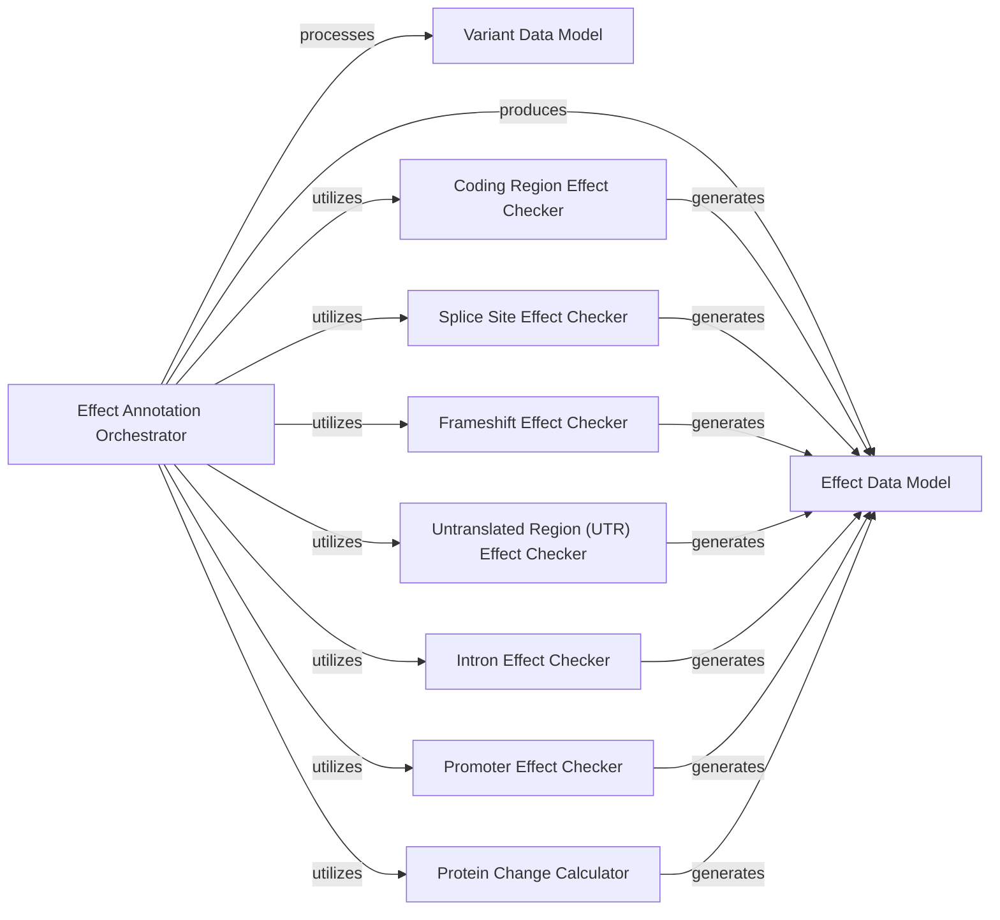

## Details

The Effect Annotation Logic subsystem is a critical computational engine within the Bioinformatics Data Platform, responsible for predicting the functional consequences of genetic variants. Its design follows a modular monolith pattern, allowing for specialized "Effect Checkers" to be integrated and orchestrated by a central Annotator.

### Effect Annotation Orchestrator
This is the primary control unit for the effect annotation process. It takes genetic variants and gene models as input, coordinates with various specialized "Effect Checkers" to determine all possible functional consequences, and aggregates their results to produce a comprehensive set of predicted effects. It manages the overall flow and ensures all relevant checks are performed.

**Related Classes/Methods**:

- `Effect Annotation Orchestrator` (1:1)

### Variant Data Model
Defines the standardized data structure for representing a genetic variant. This includes essential properties such as its chromosome, genomic position, reference allele, and alternative allele. This component ensures consistent input for the annotation process across all checkers.

**Related Classes/Methods**:

- `Variant Data Model` (1:1)

### Effect Data Model
Defines the standardized data structure for a predicted functional consequence of a genetic variant. This includes details like the effect type (e.g., "missense", "splice-site"), the affected gene, protein change, and other relevant biological context. It serves as the structured output format for the annotation results.

**Related Classes/Methods**:

- `Effect Data Model` (1:1)

### Coding Region Effect Checker
A specialized module responsible for identifying and describing effects that alter the protein-coding sequence of a gene. This includes common effects such as missense (amino acid change), nonsense (premature stop codon), and silent (no amino acid change) mutations, based on codon changes and reading frames.

**Related Classes/Methods**:

- `Coding Region Effect Checker` (1:1)

### Splice Site Effect Checker
A specialized module dedicated to detecting and characterizing genetic variants that impact RNA splicing. It focuses on mutations occurring at or near intron-exon boundaries (splice donor and acceptor sites), which can lead to altered mRNA transcripts and protein products.

**Related Classes/Methods**:

- `Splice Site Effect Checker` (1:1)

### Frameshift Effect Checker
A specialized module for identifying insertions or deletions (indels) that cause a shift in the translational reading frame of a gene. Such frameshifts typically lead to a completely altered downstream amino acid sequence and often result in a premature stop codon, producing a truncated or non-functional protein.

**Related Classes/Methods**:

- `Frameshift Effect Checker` (1:1)

### Untranslated Region (UTR) Effect Checker
Annotates variants located in the 5' and 3' untranslated regions (UTRs) of genes. While not directly coding for protein, UTRs play crucial roles in mRNA stability, translation efficiency, and localization, meaning variants here can still have significant regulatory effects.

**Related Classes/Methods**:

- `Untranslated Region (UTR) Effect Checker` (1:1)

### Intron Effect Checker
Identifies and describes variants located within intronic regions of genes. While many intronic variants are benign, some can affect splicing (e.g., by creating cryptic splice sites) or contain regulatory elements, making their annotation important for comprehensive analysis.

**Related Classes/Methods**:

- `Intron Effect Checker` (1:1)

### Promoter Effect Checker
Detects and characterizes variants in gene promoter regions. Promoters are critical regulatory sequences that control the initiation of gene transcription, so variants in these areas can significantly influence gene expression levels.

**Related Classes/Methods**:

- `Promoter Effect Checker` (1:1)

### Protein Change Calculator
Calculates and describes the specific amino acid alterations resulting from coding variants. This component translates the DNA-level changes into their precise protein-level consequences, providing the most direct functional impact.

**Related Classes/Methods**:

- `Protein Change Calculator` (1:1)

### [FAQ](https://github.com/CodeBoarding/GeneratedOnBoardings/tree/main?tab=readme-ov-file#faq)