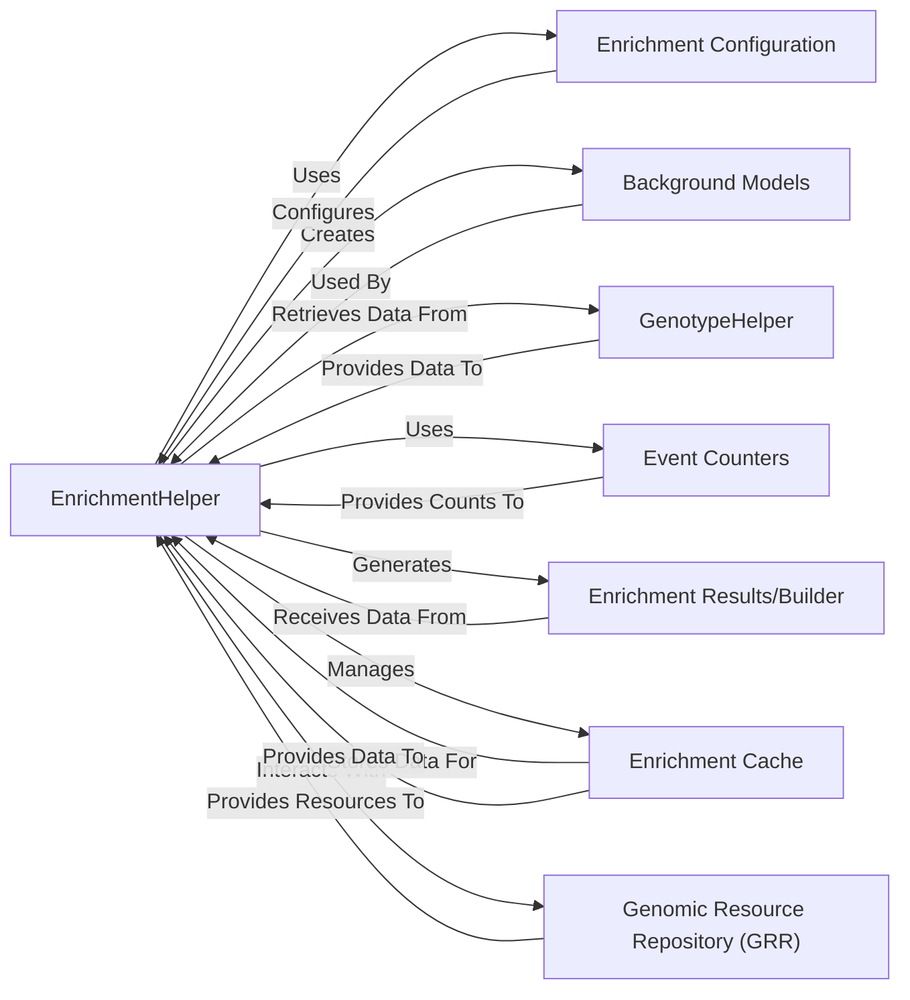

## Component Details

The Enrichment Tool subsystem is designed to perform comprehensive gene set and enrichment analysis. Its core purpose is to evaluate the statistical significance of observed genetic events (e.g., de novo mutations) within specific gene sets or against various background models. This involves managing analysis configurations, preparing statistical backgrounds, counting relevant genetic events, and presenting the results in a structured manner, often leveraging caching for performance optimization.

### EnrichmentHelper
The central orchestrator of the entire enrichment analysis process. It is responsible for loading and interpreting configurations, dynamically creating and managing different background models and event counters, retrieving and processing genotype data, executing the statistical enrichment tests, and overseeing the caching of results. It acts as the primary control point, coordinating interactions between all other components.

**Related Classes/Methods**:

- <a href="https://github.com/iossifovlab/gpf/blob/master/dae/dae/enrichment_tool/enrichment_helper.py#L1-L1" target="_blank" rel="noopener noreferrer">`dae.enrichment_tool.enrichment_helper` (1:1)</a>

### Enrichment Configuration
Defines the specific parameters and settings for an enrichment analysis. This includes specifying which types of background models and counting models to use, as well as the relevant person set collections. While not a standalone file, the logic for handling and applying these configurations is integral to EnrichmentHelper.

**Related Classes/Methods**:

- <a href="https://github.com/iossifovlab/gpf/blob/master/dae/dae/enrichment_tool/enrichment_helper.py#L1-L1" target="_blank" rel="noopener noreferrer">`dae.enrichment_tool.enrichment_helper` (1:1)</a>

### Background Models
Represents various statistical models (e.g., GeneWeightsEnrichmentBackground, GeneScoreEnrichmentBackground, SamochaEnrichmentBackground) that establish a baseline or expected frequency of genetic events. These models are crucial for providing the statistical context against which observed event counts are compared to assess true enrichment.

**Related Classes/Methods**:

- <a href="https://github.com/iossifovlab/gpf/blob/master/dae/dae/enrichment_tool/base_enrichment_background.py#L1-L1" target="_blank" rel="noopener noreferrer">`dae.enrichment_tool.base_enrichment_background` (1:1)</a>
- <a href="https://github.com/iossifovlab/gpf/blob/master/dae/dae/enrichment_tool/gene_weights_background.py#L1-L1" target="_blank" rel="noopener noreferrer">`dae.enrichment_tool.gene_weights_background` (1:1)</a>
- <a href="https://github.com/iossifovlab/gpf/blob/master/dae/dae/enrichment_tool/samocha_background.py#L1-L1" target="_blank" rel="noopener noreferrer">`dae.enrichment_tool.samocha_background` (1:1)</a>
- `dae.enrichment_tool.gene_score_background` (1:1)

### GenotypeHelper
Solely responsible for efficiently retrieving and filtering genotype data, with a specific focus on de novo genetic events. This filtered data serves as the precise input for the event counting process, ensuring that only relevant genetic variations are considered for enrichment analysis.

**Related Classes/Methods**:

- <a href="https://github.com/iossifovlab/gpf/blob/master/dae/dae/enrichment_tool/genotype_helper.py#L1-L1" target="_blank" rel="noopener noreferrer">`dae.enrichment_tool.genotype_helper` (1:1)</a>

### Event Counters
These components are responsible for accurately counting the occurrences of specific genetic events based on the processed genotype data and the defined enrichment criteria. They produce aggregated counts (EventCountersResult) that are then utilized by the EnrichmentHelper for statistical testing.

**Related Classes/Methods**:

- <a href="https://github.com/iossifovlab/gpf/blob/master/dae/dae/enrichment_tool/event_counters.py#L1-L1" target="_blank" rel="noopener noreferrer">`dae.enrichment_tool.event_counters` (1:1)</a>

### Enrichment Results/Builder
This component is responsible for constructing the final enrichment results object or structure. It aggregates the counts from Event Counters and applies the statistical context derived from Background Models to produce a comprehensive and interpretable enrichment report.

**Related Classes/Methods**:

- <a href="https://github.com/iossifovlab/gpf/blob/master/dae/dae/enrichment_tool/enrichment_builder.py#L1-L1" target="_blank" rel="noopener noreferrer">`dae.enrichment_tool.enrichment_builder` (1:1)</a>
- <a href="https://github.com/iossifovlab/gpf/blob/master/dae/dae/enrichment_tool/event_counters.py#L1-L1" target="_blank" rel="noopener noreferrer">`dae.enrichment_tool.event_counters` (1:1)</a>

### Enrichment Cache
Manages the caching mechanism for pre-computed enrichment event counts. Its primary purpose is to significantly improve performance by storing and retrieving previously calculated results, thereby avoiding redundant and computationally intensive calculations, especially for repeated queries.

**Related Classes/Methods**:

- <a href="https://github.com/iossifovlab/gpf/blob/master/dae/dae/enrichment_tool/enrichment_cache_builder.py#L1-L1" target="_blank" rel="noopener noreferrer">`dae.enrichment_tool.enrichment_cache_builder` (1:1)</a>
- <a href="https://github.com/iossifovlab/gpf/blob/master/dae/dae/enrichment_tool/enrichment_helper.py#L1-L1" target="_blank" rel="noopener noreferrer">`dae.enrichment_tool.enrichment_helper` (1:1)</a>

### Genomic Resource Repository (GRR)
An external system or interface that provides access to various genomic resources. Within the Enrichment Tool, it is specifically used by the EnrichmentHelper to retrieve and load the necessary data for constructing different Background Models (e.g., gene weights, gene scores).

**Related Classes/Methods**: _None_

### [FAQ](https://github.com/CodeBoarding/GeneratedOnBoardings/tree/main?tab=readme-ov-file#faq)