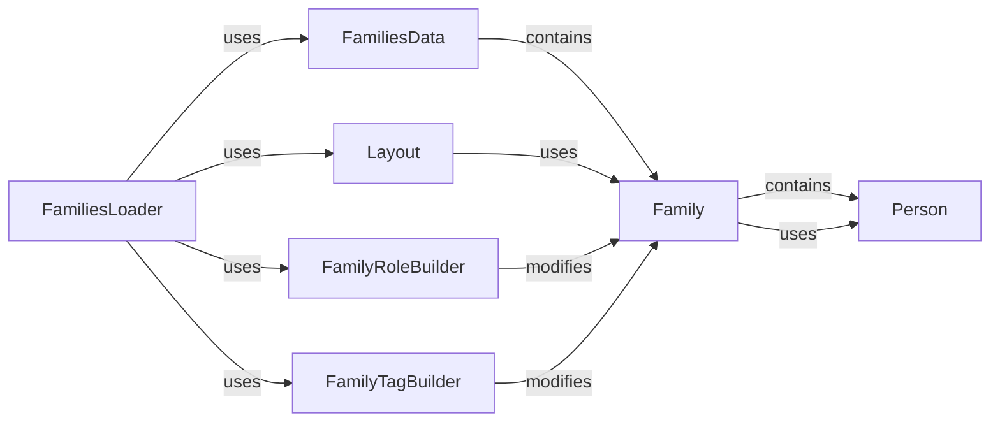

## Component Details

The `FamiliesLoader` component is central to handling pedigree information within the project. It orchestrates the loading, parsing, and structuring of family data from various input formats into a standardized internal representation. This component is dedicated to the loading, parsing, and structuring of pedigree information. It supports various pedigree file formats and transforms them into a standardized `FamiliesData` object, ensuring that family relationships and individual roles are accurately represented.

### FamiliesLoader
The primary orchestrator for loading pedigree data. It handles different input file formats (e.g., .ped, simple family format) and coordinates the process of reading the raw data, building the family structure, inferring roles, and generating layouts.

**Related Classes/Methods**:

- <a href="https://github.com/iossifovlab/gpf/blob/master/dae/dae/pedigrees/loader.py#L42-L619" target="_blank" rel="noopener noreferrer">`dae.dae.pedigrees.loader.FamiliesLoader` (42:619)</a>

### FamiliesData
This class defines the canonical in-memory data model for a collection of families within a study. It acts as a central repository for multiple `Family` objects, providing methods for efficient access, querying, and combining family information.

**Related Classes/Methods**:

- <a href="https://github.com/iossifovlab/gpf/blob/master/dae/dae/pedigrees/families_data.py#L115-L364" target="_blank" rel="noopener noreferrer">`dae.dae.pedigrees.families_data.FamiliesData` (115:364)</a>

### Family
Represents a single family unit. It encapsulates a collection of `Person` objects and provides methods to define and query familial relationships (e.g., parents, children, siblings, trios) within that specific family.

**Related Classes/Methods**:

- <a href="https://github.com/iossifovlab/gpf/blob/master/dae/dae/pedigrees/family.py#L370-L603" target="_blank" rel="noopener noreferrer">`dae.dae.pedigrees.family.Family` (370:603)</a>

### Person
Represents an individual within a family. It stores essential attributes such as person ID, family ID, sex, affected status, role (e.g., proband, mother, father, sibling), and links to parents.

**Related Classes/Methods**:

- <a href="https://github.com/iossifovlab/gpf/blob/master/dae/dae/pedigrees/family.py#L123-L349" target="_blank" rel="noopener noreferrer">`dae.dae.pedigrees.family.Person` (123:349)</a>

### Layout
This component is responsible for generating and managing the visual layout of pedigree diagrams. It calculates and stores the coordinates for each individual and the lines representing their relationships, facilitating graphical representation.

**Related Classes/Methods**:

- <a href="https://github.com/iossifovlab/gpf/blob/master/dae/dae/pedigrees/layout.py#L141-L882" target="_blank" rel="noopener noreferrer">`dae.dae.pedigrees.layout.Layout` (141:882)</a>

### FamilyRoleBuilder
A utility class used to infer and assign roles (e.g., proband, mother, father, sibling) to individuals within a family, particularly when this information is not explicitly available in the raw input pedigree file.

**Related Classes/Methods**:

- <a href="https://github.com/iossifovlab/gpf/blob/master/dae/dae/pedigrees/family_role_builder.py#L35-L299" target="_blank" rel="noopener noreferrer">`dae.dae.pedigrees.family_role_builder.FamilyRoleBuilder` (35:299)</a>

### FamilyTagBuilder
A utility class responsible for assigning predefined tags to families based on their structural characteristics (e.g., "trio", "quad", "simplex"). These tags help categorize and filter families for specific analyses.

**Related Classes/Methods**:

- <a href="https://github.com/iossifovlab/gpf/blob/master/dae/dae/pedigrees/family_tag_builder.py#L1-L1" target="_blank" rel="noopener noreferrer">`dae.dae.pedigrees.family_tag_builder.FamilyTagBuilder` (1:1)</a>

### [FAQ](https://github.com/CodeBoarding/GeneratedOnBoardings/tree/main?tab=readme-ov-file#faq)