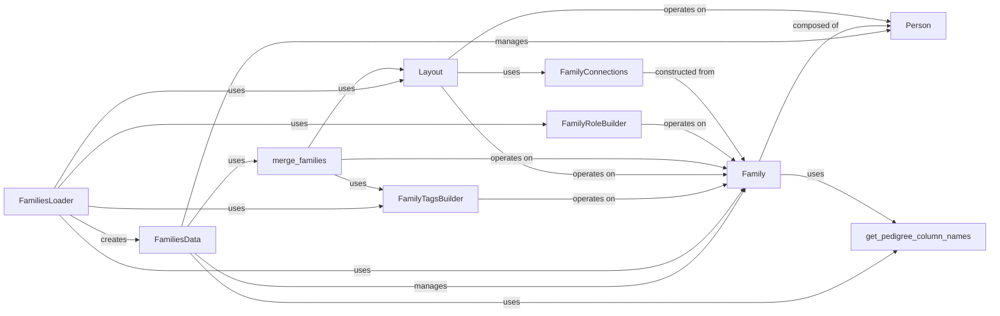

## Component Details

This subsystem is dedicated to the robust loading, parsing, representation, and manipulation of pedigree (family) information. It forms the foundational layer for genetic analysis by providing accurate and structured family data, which is subsequently utilized by variant loaders and other downstream processes.

### FamiliesData
The central data management component. It acts as a comprehensive collection and manager for `Family` objects. It provides various static methods for constructing instances from different data sources (e.g., lists of `Person` objects, pandas DataFrames, or existing family dictionaries). It also supports combining multiple `FamiliesData` objects and offers extensive methods for accessing and querying family and person information. Internally, it maintains dictionaries for efficient lookup of families and persons.

**Related Classes/Methods**:

- <a href="https://github.com/iossifovlab/gpf/blob/master/dae/dae/pedigrees/family.py#L370-L603" target="_blank" rel="noopener noreferrer">`Family` (370:603)</a>
- `Person` (0:0)
- `merge_families` (0:0)
- `get_pedigree_column_names` (0:0)

### Family
Represents a single family unit. It encapsulates a collection of `Person` objects and defines the relationships between individuals within that family (e.g., parents, children, siblings). It provides methods to add members, redefine its internal structure, and retrieve members based on various criteria (e.g., roles, statuses). It also supports tagging with `FamilyTag`s.

**Related Classes/Methods**:

- `Person` (0:0)
- `get_pedigree_column_names` (0:0)

### Person
Represents an individual within a family. It holds fundamental attributes such as person ID, family ID, mother ID, father ID, sex, status, sample ID, and various `FamilyTag`s. It also includes properties to indicate if a person is generated, not sequenced, or missing.

**Related Classes/Methods**: _None_

### FamiliesLoader
Responsible for loading and parsing pedigree files (e.g., `.ped` files) into `FamiliesData` objects. It orchestrates the process of reading the file, building `FamiliesData` and `Family` objects, and applying layouts, roles, and tags based on configuration.

**Related Classes/Methods**:

- <a href="https://github.com/iossifovlab/gpf/blob/master/dae/dae/pedigrees/families_data.py#L115-L364" target="_blank" rel="noopener noreferrer">`FamiliesData` (115:364)</a>
- <a href="https://github.com/iossifovlab/gpf/blob/master/dae/dae/pedigrees/family.py#L370-L603" target="_blank" rel="noopener noreferrer">`Family` (370:603)</a>
- <a href="https://github.com/iossifovlab/gpf/blob/master/dae/dae/pedigrees/layout.py#L141-L882" target="_blank" rel="noopener noreferrer">`Layout` (141:882)</a>
- <a href="https://github.com/iossifovlab/gpf/blob/master/dae/dae/pedigrees/family_role_builder.py#L35-L299" target="_blank" rel="noopener noreferrer">`FamilyRoleBuilder` (35:299)</a>
- `FamilyTagsBuilder` (0:0)

### FamilyTagsBuilder
A utility class dedicated to applying various predefined tags to `Family` objects. These tags classify families based on characteristics like family structure (e.g., nuclear, trio, quad) or affected status of members.

**Related Classes/Methods**:

- <a href="https://github.com/iossifovlab/gpf/blob/master/dae/dae/pedigrees/family.py#L370-L603" target="_blank" rel="noopener noreferrer">`Family` (370:603)</a>

### Layout
This component is responsible for generating and applying a visual layout (coordinates and ranks) to `Family` objects, primarily for pedigree visualization. It calculates the optimal positioning of individuals within a family structure, handling complex family connections and optimizing the drawing. It can also reconstruct layouts from existing layout data stored on `Person` objects.

**Related Classes/Methods**:

- <a href="https://github.com/iossifovlab/gpf/blob/master/dae/dae/pedigrees/family.py#L370-L603" target="_blank" rel="noopener noreferrer">`Family` (370:603)</a>
- `Person` (0:0)
- `FamilyConnections` (0:0)

### merge_families
A standalone function that encapsulates the logic for merging two individual `Family` objects. This is crucial when combining `FamiliesData` instances that might contain overlapping family definitions, ensuring data consistency and proper attribute resolution.

**Related Classes/Methods**:

- <a href="https://github.com/iossifovlab/gpf/blob/master/dae/dae/pedigrees/family.py#L370-L603" target="_blank" rel="noopener noreferrer">`Family` (370:603)</a>
- <a href="https://github.com/iossifovlab/gpf/blob/master/dae/dae/pedigrees/layout.py#L141-L882" target="_blank" rel="noopener noreferrer">`Layout` (141:882)</a>
- `FamilyTagsBuilder` (0:0)

### FamilyRoleBuilder
This component is responsible for inferring and assigning roles (e.g., proband, mother, father, sibling) to individuals within a family. This is particularly important when the input pedigree data lacks explicit role information, ensuring that family relationships are correctly established.

**Related Classes/Methods**:

- <a href="https://github.com/iossifovlab/gpf/blob/master/dae/dae/pedigrees/family.py#L370-L603" target="_blank" rel="noopener noreferrer">`Family` (370:603)</a>

### FamilyConnections
This class represents the graph structure of a family, including individuals and their relationships (parents, children, mates). It provides methods to analyze connectivity and extract connected components, which is essential for layout generation and other graph-based operations on family data.

**Related Classes/Methods**:

- <a href="https://github.com/iossifovlab/gpf/blob/master/dae/dae/pedigrees/family.py#L370-L603" target="_blank" rel="noopener noreferrer">`Family` (370:603)</a>

### get_pedigree_column_names
A utility function that provides a standardized and ordered list of column names for pedigree data. This ensures consistency when converting family data to tabular formats (e.g., pandas DataFrames) for output or further processing.

**Related Classes/Methods**: _None_

### [FAQ](https://github.com/CodeBoarding/GeneratedOnBoardings/tree/main?tab=readme-ov-file#faq)