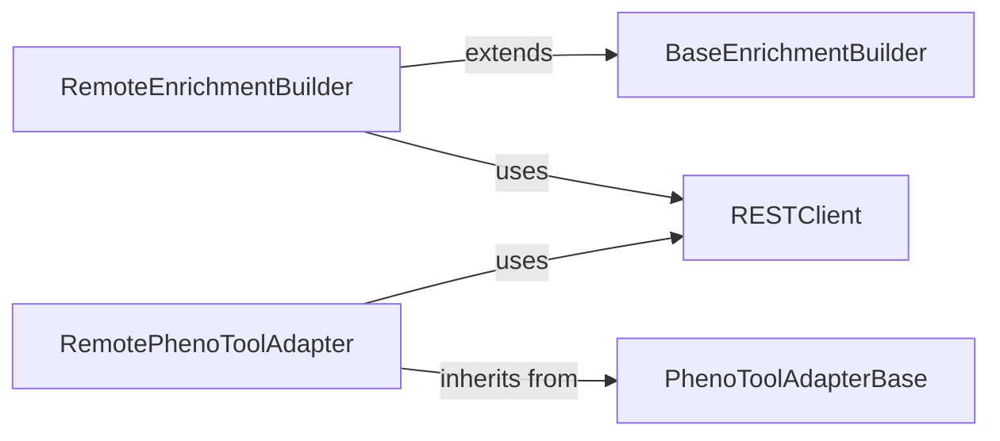

## Component Details

This subsystem is designed to facilitate the execution of complex analysis tasks, such as enrichment analysis and pheno tool queries, across distributed GPF (Genomic Phentoype Federation) instances. Its primary purpose is to abstract the complexities of remote communication, allowing users to perform analyses on data residing in federated GPF servers as if they were local.

### RemoteEnrichmentBuilder
A concrete builder responsible for constructing and dispatching enrichment analysis queries to a remote GPF instance. It translates the analysis request into a format consumable by the remote API and processes the results received.

**Related Classes/Methods**:

- <a href="https://github.com/iossifovlab/gpf/blob/master/federation/federation/remote_enrichment_builder.py#L9-L34" target="_blank" rel="noopener noreferrer">`RemoteEnrichmentBuilder` (9:34)</a>

### RemotePhenoToolAdapter
A concrete adapter that enables interaction with a remote PhenoTool. It prepares pheno tool queries and sends them to a federated GPF instance, acting as a proxy for remote pheno tool calculations.

**Related Classes/Methods**:

- <a href="https://github.com/iossifovlab/gpf/blob/master/federation/federation/remote_pheno_tool_adapter.py#L7-L27" target="_blank" rel="noopener noreferrer">`RemotePhenoToolAdapter` (7:27)</a>

### BaseEnrichmentBuilder
An abstract base class that defines the fundamental interface and common initialization steps for all enrichment analysis builders. It ensures a consistent structure for any enrichment builder, whether local or remote.

**Related Classes/Methods**:

- `BaseEnrichmentBuilder` (1:1)

### PhenoToolAdapterBase
An abstract base class that establishes the contract for all pheno tool adapters. It outlines the methods (e.g., `calc_variants`, `calc_by_effect`) that concrete adapters must implement to interact with pheno tool functionalities.

**Related Classes/Methods**:

- `PhenoToolAdapterBase` (1:1)

### RESTClient
A core utility component responsible for handling all HTTP/REST communication with remote GPF instances. It manages API endpoints, authentication, request serialization, and response deserialization, acting as the network layer for federated operations.

**Related Classes/Methods**:

- `RESTClient` (1:1)

### [FAQ](https://github.com/CodeBoarding/GeneratedOnBoardings/tree/main?tab=readme-ov-file#faq)