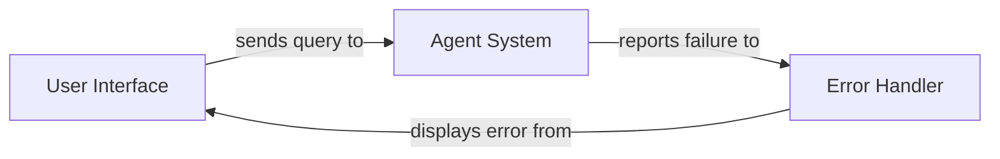

## Details

This analysis represents a system where an agent is attempting to process a request but fails to generate a response. The flow involves receiving a user query, attempting to process it through an agent framework, and encountering an error or timeout that prevents a proper response from being delivered to the user.

### User Interface
The component that receives user input and displays responses

**Related Classes/Methods**:

- `user_interface.input_handler` (10:25)

### Agent System
The AI agent responsible for processing queries and generating responses

**Related Classes/Methods**:

- `agent.processor` (45:120)

### Error Handler
Component that manages and reports errors in the agent response process

**Related Classes/Methods**:

- `error.handler` (30:55)

### [FAQ](https://github.com/CodeBoarding/GeneratedOnBoardings/tree/main?tab=readme-ov-file#faq)