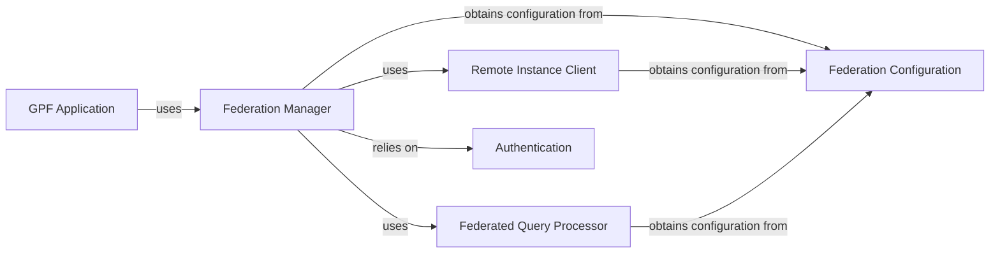

## Component Details

The Federation Layer is a crucial sub-component within the GPF system, enabling distributed GPF instances to query and access data from other remote GPF deployments. This facilitates federated analyses and seamless data sharing across multiple GPF instances.

### Federation Manager
The central orchestrator for all federated operations. It coordinates the entire process of a federated query, from receiving the initial request to dispatching sub-queries and aggregating results from various remote instances.

**Related Classes/Methods**:

- <a href="https://github.com/iossifovlab/gpf/blob/master/federation/federation/remote_extension.py#L1-L1" target="_blank" rel="noopener noreferrer">`federation.federation.remote_extension.RemoteExtension` (1:1)</a>

### Remote Instance Client
Responsible for establishing and managing connections to individual remote GPF instances. It handles the low-level communication protocols, including HTTP requests, data serialization, and deserialization, to send queries and receive data from external GPF deployments. It also manages authentication with remote instances.

**Related Classes/Methods**:

- <a href="https://github.com/iossifovlab/gpf/blob/master/federation/federation/rest_api_client.py#L21-L636" target="_blank" rel="noopener noreferrer">`federation.federation.rest_api_client.RESTClient` (21:636)</a>

### Federated Query Processor
Analyzes incoming queries to determine which data sources (local or remote) are needed. It breaks down the original query into sub-queries, dispatches them to the appropriate Remote Instance Client (for remote parts) or local data access components, and then merges the results from all sources into a single, coherent response.

**Related Classes/Methods**:

- <a href="https://github.com/iossifovlab/gpf/blob/master/federation/federation/remote_study.py#L1-L1" target="_blank" rel="noopener noreferrer">`federation.federation.remote_study.RemoteStudy` (1:1)</a>
- <a href="https://github.com/iossifovlab/gpf/blob/master/federation/federation/remote_variant.py#L132-L150" target="_blank" rel="noopener noreferrer">`federation.federation.remote_variant.RemoteVariant` (132:150)</a>

### Federation Configuration
Manages the configuration details for all known remote GPF instances. This includes their network addresses (URLs), API endpoints, and potentially authentication credentials or security certificates. It might also maintain a registry of available studies or datasets on each remote instance.

**Related Classes/Methods**:

- <a href="https://github.com/iossifovlab/gpf/blob/master/federation/federation/remote_extension.py#L1-L1" target="_blank" rel="noopener noreferrer">`federation.federation.remote_extension.RemoteExtension` (1:1)</a>

### GPF Application
The main GPF application that initiates and utilizes the Federation Layer for distributed data access. It acts as the consumer of the federated data.

**Related Classes/Methods**:

- <a href="https://github.com/iossifovlab/gpf/blob/master/wdae/wdae/gpf_instance/gpf_instance.py#L1-L1" target="_blank" rel="noopener noreferrer">`wdae.wdae.gpf_instance.gpf_instance` (1:1)</a>

### Authentication
Provides secure communication and access control when querying remote GPF instances. It handles user authentication and authorization for federated queries.

**Related Classes/Methods**:

- <a href="https://github.com/iossifovlab/gpf/blob/master/rest_client/rest_client/rest_client.py#L1-L1" target="_blank" rel="noopener noreferrer">`rest_client.rest_client.rest_client.GPFOAuth2Client` (1:1)</a>
- <a href="https://github.com/iossifovlab/gpf/blob/master/wdae/wdae/users_api/views.py#L1-L1" target="_blank" rel="noopener noreferrer">`wdae.wdae.users_api.views` (1:1)</a>

### [FAQ](https://github.com/CodeBoarding/GeneratedOnBoardings/tree/main?tab=readme-ov-file#faq)