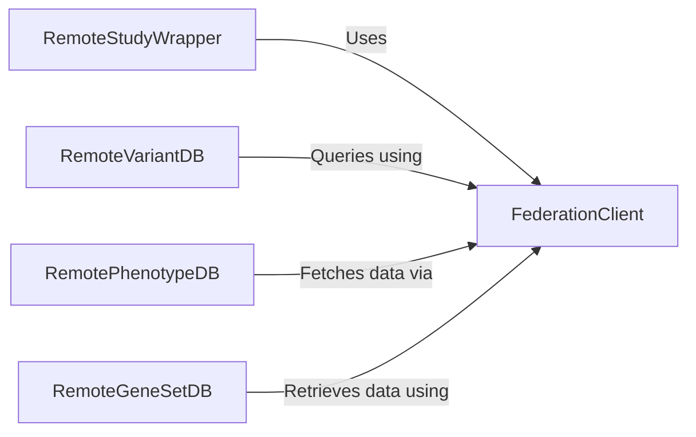

## Details

One paragraph explaining the functionality which is represented by this graph. What the main flow is and what is its purpose.

### FederationClient
The core communication component. It is a low-level client responsible for handling all RESTful API requests (GET, POST) to remote GPF instances. It manages connection details, authentication, and data serialization/deserialization, acting as the gateway for all federated interactions.

**Related Classes/Methods**:

- `FederationClient` (1:1)

### RemoteStudyWrapper
An adapter that makes a remote genomic study appear as a local one. It wraps a FederationClient and provides high-level methods to query variants and access study-specific data, translating these calls into API requests to the remote instance.

**Related Classes/Methods**:

- <a href="https://github.com/iossifovlab/gpf/blob/master/federation/federation/remote_study_wrapper.py#L1-L1" target="_blank" rel="noopener noreferrer">`RemoteStudyWrapper` (1:1)</a>

### RemoteVariantDB
Represents the variant database of a remote GPF instance. It implements the standard variant database interface but delegates the actual data fetching to the FederationClient, allowing the core engine to query remote variants seamlessly.

**Related Classes/Methods**:

- `RemoteVariantDB` (1:1)

### RemotePhenotypeDB
An adapter for remote phenotype data. It conforms to the local phenotype database interface, enabling the system to query and retrieve phenotype information from a remote instance by making API calls through the FederationClient.

**Related Classes/Methods**:

- `RemotePhenotypeDB` (1:1)

### RemoteGeneSetDB
An adapter for remote gene sets. It provides the standard interface for querying gene sets, but all operations are translated into remote API calls that are executed by the FederationClient.

**Related Classes/Methods**:

- `RemoteGeneSetDB` (1:1)

### [FAQ](https://github.com/CodeBoarding/GeneratedOnBoardings/tree/main?tab=readme-ov-file#faq)