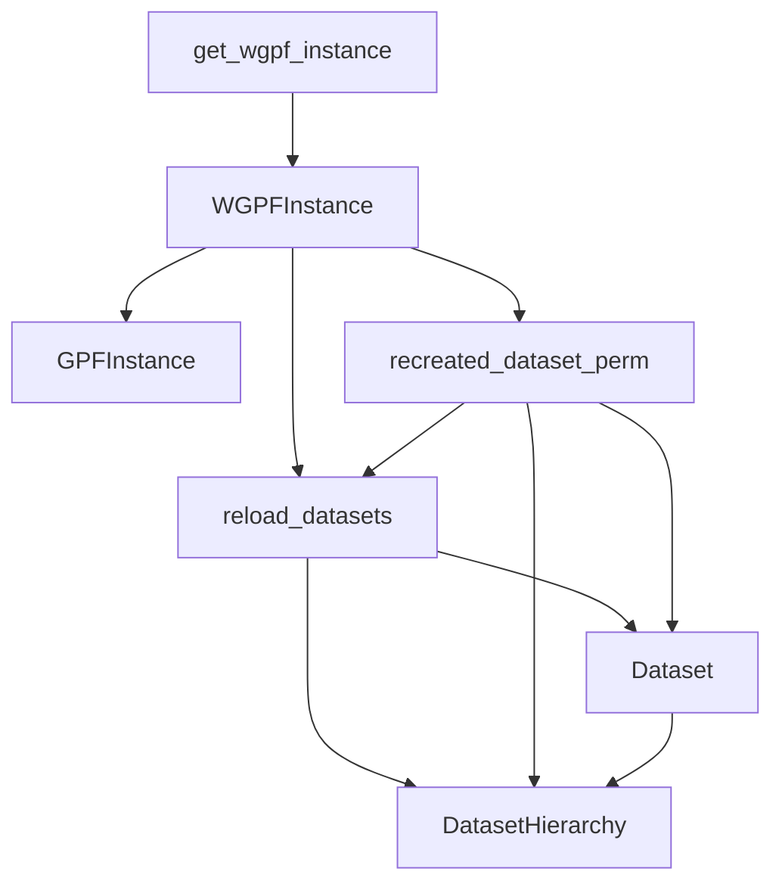

## GPF Core & Configuration Overview

The `GPF Core & Configuration` component is central to the GPF system, particularly within the WDAE environment. Its primary responsibility is to load and manage the core GPF instance, providing access to various genomic and phenotypic data resources. This component ensures that the application operates with a single, consistent GPF configuration and instance, handling the complexities of dataset loading, permissions, and hierarchical relationships.

### Component Descriptions

*   **get_wgpf_instance**
    *   **Description:** This function serves as a singleton factory for the `WGPFInstance`. It ensures that only one instance of the WDAE-specific GPF core is created and used throughout the application, managing its lifecycle and initialization based on the system configuration.
    *   **Relationship to Neighbors:** It creates and returns the `WGPFInstance`. Other parts of the application interact with the GPF core by calling this function to obtain the singleton instance.
    *   **Relevant Source Files:** `repos/gpf/wdae/wdae/gpf_instance/gpf_instance.py`

*   **WGPFInstance**
    *   **Description:** This class represents the GPF core instance specifically adapted for the WDAE web environment. It extends the base `GPFInstance` with functionalities required for a web application, such as managing study wrappers and handling WDAE-specific configurations and data access patterns.
    *   **Relationship to Neighbors:** It inherits core functionalities from `GPFInstance`. It is created by `get_wgpf_instance` and is utilized by functions like `reload_datasets` and `recreated_dataset_perm` to access and manage dataset information. It interacts with `Dataset` and `DatasetHierarchy` indirectly through these functions.
    *   **Relevant Source Files:** `repos/gpf/wdae/wdae/gpf_instance/gpf_instance.py`

*   **GPFInstance**
    *   **Description:** This is the base class for the core GPF instance. It provides fundamental capabilities for loading and accessing various types of genomic data, phenotypic data, gene scores, and other essential resources defined in the GPF configuration.
    *   **Relationship to Neighbors:** It is the parent class of `WGPFInstance`, providing the core data access and management logic that `WGPFInstance` builds upon.
    *   **Relevant Source Files:** `dae/gpf_instance/gpf_instance.py`

*   **reload_datasets**
    *   **Description:** This function is responsible for refreshing the dataset permissions and the hierarchical structure of datasets within the WDAE application. It clears existing database entries for dataset hierarchy and permissions and rebuilds them based on the currently available datasets in the `WGPFInstance`.
    *   **Relationship to Neighbors:** It takes a `WGPFInstance` as input to get the list of available datasets. It directly interacts with the `Dataset` and `DatasetHierarchy` Django models to update the database with the correct permissions and hierarchical relationships.
    *   **Relevant Source Files:** `repos/gpf/wdae/wdae/gpf_instance/gpf_instance.py`

*   **recreated_dataset_perm**
    *   **Description:** This function acts as a safeguard to ensure that the `reload_datasets` process is executed only once for a given `WGPFInstance` during the application's lifecycle. It prevents redundant and potentially disruptive reloads of dataset permissions and hierarchy.
    *   **Relationship to Neighbors:** It calls `reload_datasets` if the dataset permissions have not been recreated yet for the provided `WGPFInstance`. It indirectly interacts with `Dataset` and `DatasetHierarchy` by triggering `reload_datasets`.
    *   **Relevant Source Files:** `repos/gpf/wdae/wdae/gpf_instance/gpf_instance.py`

*   **Dataset**
    *   **Description:** This is a Django model that represents a dataset within the WDAE database. It stores information about the dataset, including its ID, name, and broken status, and manages its associated permissions through Django's Group model.
    *   **Relationship to Neighbors:** It is used by `reload_datasets` and `recreated_dataset_perm` to create, update, and manage dataset entries and their permissions in the database. It has a many-to-many relationship with Django's `Group` model (not shown in this specific diagram) and is referenced by `DatasetHierarchy`.
    *   **Relevant Source Files:** `datasets_api/models.py`

*   **DatasetHierarchy**
    *   **Description:** This is a Django model that stores the hierarchical relationships between datasets in the WDAE database. It records which datasets are ancestors or descendants of others, including whether the relationship is direct.
    *   **Relationship to Neighbors:** It is used by `reload_datasets` and `recreated_dataset_perm` to clear and add hierarchical relationships between `Dataset` objects in the database.
    *   **Relevant Source Files:** `datasets_api/models.py`
