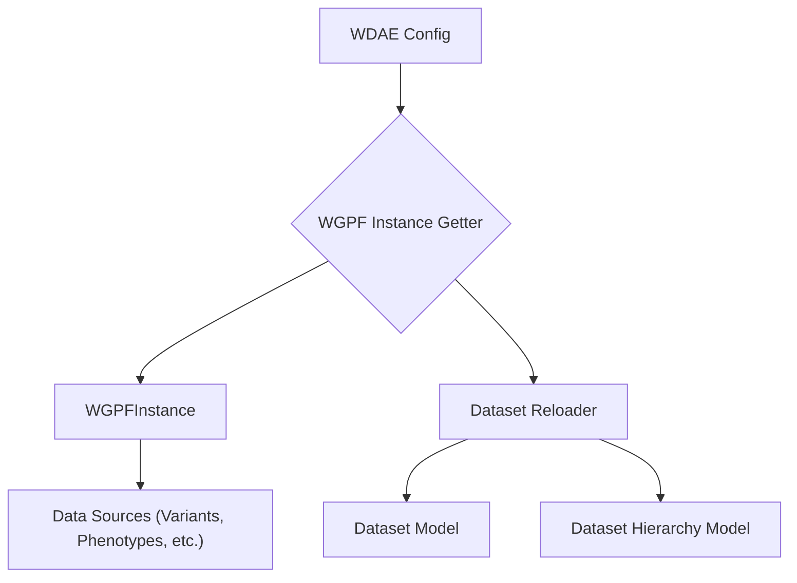

## Component Overview: GPF Core & Configuration

The `GPF Core & Configuration` component is central to the WDAE application, responsible for loading the core GPF configuration and managing the singleton `WGPFInstance`. This instance serves as the primary access point to various genomic and phenotypic data types and resources used throughout the application.

### Data Flow Diagram

### Component Descriptions

Here are the key components involved in the GPF Core & Configuration, their purpose, functionality, and interactions:

*   **WDAE Config**
    *   **Description:** Django application configuration responsible for initializing the WGPFInstance when WDAE starts.
    *   **Functionality:** Its `ready` method is called on application startup, which triggers the loading of the WGPFInstance using the `get_wgpf_instance` function and loads WDAE extensions.
    *   **Interactions:** Calls `WGPF Instance Getter` to obtain the core GPF instance.
    *   **Relevant Files:** `wdae.gpf_instance.apps.WDAEConfig`

*   **WGPF Instance Getter**
    *   **Description:** Provides a singleton instance of WGPFInstance for the WDAE application.
    *   **Functionality:** Checks if an instance exists; if not, it builds a new `WGPFInstance` using the configured path and stores it. It also triggers the `recreated_dataset_perm` function to set up dataset permissions based on the loaded instance.
    *   **Interactions:** Creates/returns the `WGPFInstance` and calls the `Dataset Reloader` to synchronize dataset information with the database models.
    *   **Relevant Files:** `dae.gpf_instance.gpf_instance.get_wgpf_instance`

*   **WGPFInstance**
    *   **Description:** The core GPF instance class specifically adapted for use within the WDAE web application.
    *   **Functionality:** Manages access to various genomic and phenotypic data sources (like variants, phenotypes, gene scores, and gene profiles), provides WDAE-specific data access methods (such as retrieving study wrappers), and prepares configurations (like gene profile configuration). It holds the loaded GPF configuration.
    *   **Interactions:** Created by the `WGPF Instance Getter`. It interacts with underlying `Data Sources` to retrieve genomic and phenotypic information.
    *   **Relevant Files:** `dae.gpf_instance.gpf_instance.WGPFInstance`

*   **Dataset Reloader**
    *   **Description:** Handles the reloading and recreation of dataset permissions and hierarchy within WDAE.
    *   **Functionality:** Iterates through available datasets provided by the `WGPFInstance`, updates their status and names in the `Dataset Model`, and rebuilds the dataset hierarchy in the `Dataset Hierarchy Model` to reflect the current GPF instance configuration.
    *   **Interactions:** Called by the `WGPF Instance Getter`. It interacts directly with the `Dataset Model` and `Dataset Hierarchy Model` to update database records.
    *   **Relevant Files:** `dae.gpf_instance.gpf_instance.reload_datasets`, `dae.gpf_instance.gpf_instance.recreated_dataset_perm`

*   **Dataset Model**
    *   **Description:** Django model representing datasets in the database.
    *   **Functionality:** Stores dataset information, manages dataset permissions through Django's group system, and tracks dataset status (e.g., broken). It provides methods for recreating permissions and updating dataset details.
    *   **Interactions:** Used by the `Dataset Reloader` and `Dataset Permissions` components to manage dataset data and access control.
    *   **Relevant Files:** `datasets_api.models.Dataset`

*   **Dataset Hierarchy Model**
    *   **Description:** Django model representing the hierarchical relationships between datasets in the database.
    *   **Functionality:** Stores parent-child relationships between datasets, used for organizing datasets and determining the inheritance of permissions.
    *   **Interactions:** Used by the `Dataset Reloader` and `Dataset Permissions` components to manage and query the dataset hierarchy.
    *   **Relevant Files:** `datasets_api.models.DatasetHierarchy`

*   **Data Sources (Variants, Phenotypes, etc.)**
    *   **Description:** Represents the various underlying data storage systems for genomic and phenotypic data.
    *   **Functionality:** These include components like the Variants Database, Phenotype Registry, Gene Scores Database, and Gene Profile Database, which manage access to the actual data files and databases.
    *   **Interactions:** The `WGPFInstance` interacts with these components to retrieve specific data requested by the application.
    *   **Relevant Files:** `dae.studies.variants_db.VariantsDb`, `dae.pheno.registry.PhenoRegistry`, `dae.gene_scores.gene_scores.GeneScoresDb`, `dae.gene_profile.db.GeneProfileDB`, etc.
