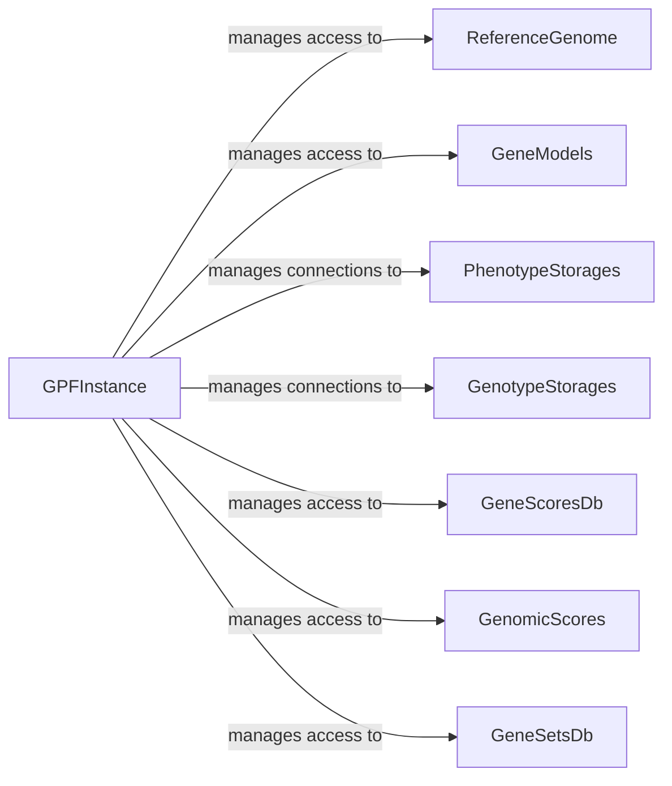

## Component Details

The GPF Core Management component centers around the `GPFInstance` class, which serves as a central hub for accessing and managing various genomic resources and data within a GPF instance. It handles the initialization and configuration of the environment, loading databases, and providing access to genotype data, phenotype data, gene sets, and annotation pipelines. The component facilitates data retrieval and analysis by connecting to different storage backends and providing access to precomputed scores and reports. It acts as a central point for accessing and integrating diverse data sources within the GPF ecosystem.

### GPFInstance
The central class that manages access to various GPF resources like genotype data, phenotype data, gene scores, and annotation pipelines. It initializes and configures the environment for data access.
- **Related Classes/Methods**: `gpf.dae.dae.gpf_instance.gpf_instance.GPFInstance`

### ReferenceGenome
Provides access to the reference genome used in the GPF instance. It is a crucial resource for aligning and interpreting genomic data.
- **Related Classes/Methods**: `gpf.dae.dae.gpf_instance.gpf_instance.GPFInstance:reference_genome`

### GeneModels
Provides access to gene models used in the GPF instance. Gene models define the structure and location of genes within the genome.
- **Related Classes/Methods**: `gpf.dae.dae.gpf_instance.gpf_instance.GPFInstance:gene_models`

### PhenotypeStorages
Manages connections to phenotype storage backends. These storages hold phenotype data associated with individuals or samples.
- **Related Classes/Methods**: `gpf.dae.dae.gpf_instance.gpf_instance.GPFInstance:phenotype_storages`

### GenotypeStorages
Manages connections to genotype storage backends. These storages hold genotype data, such as variant calls and sequencing reads.
- **Related Classes/Methods**: `gpf.dae.dae.gpf_instance.gpf_instance.GPFInstance:genotype_storages`

### GeneScoresDb
Provides access to gene scores database. Gene scores quantify the importance or impact of genes based on various criteria.
- **Related Classes/Methods**: `gpf.dae.dae.gpf_instance.gpf_instance.GPFInstance:gene_scores_db`

### GenomicScores
Provides access to genomic scores. Genomic scores represent the functional significance of genomic regions or variants.
- **Related Classes/Methods**: `gpf.dae.dae.gpf_instance.gpf_instance.GPFInstance:genomic_scores`

### GeneSetsDb
Provides access to gene sets database. Gene sets are collections of genes that share a common function or pathway.
- **Related Classes/Methods**: `gpf.dae.dae.gpf_instance.gpf_instance.GPFInstance:gene_sets_db`
