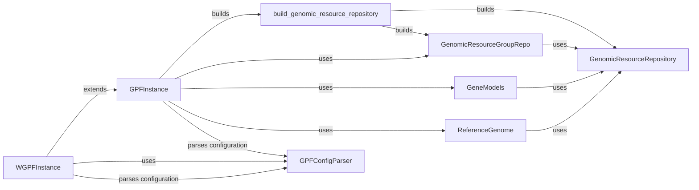

## Component Details

### GPFInstance
Represents a GPF instance, providing access to genomic resources and datasets. It manages the configuration and lifecycle of these resources, including genomic resources, annotation pipelines, and storage backends. It initializes and manages the GPF environment, offering access to genomic resources, annotation pipelines, and storage backends.
- **Related Classes/Methods**: `dae.gpf_instance.gpf_instance.GPFInstance`

### WGPFInstance
Extends GPFInstance to provide WDAE-specific functionalities. It handles study wrappers, GP configuration, and dataset visibility, integrating the GPF instance with the web application. It also manages dataset permissions and broken status, providing a cohesive interface for web-based analysis.
- **Related Classes/Methods**: `dae.wdae.gpf_instance.gpf_instance.WGPFInstance`

### GenomicResourceRepository
An interface for accessing and managing genomic resources. Different implementations exist, such as file-based, HTTP-based, and group repositories. It provides a way to retrieve and manage genomic resources from various sources.
- **Related Classes/Methods**: `dae.genomic_resources.repository.GenomicResourceRepo`

### build_genomic_resource_repository
A factory function that builds a GenomicResourceRepo based on a given definition (either a dictionary or a YAML file). It supports various repository types like group, file, HTTP, S3, and in-memory. This function simplifies the creation of different types of genomic resource repositories.
- **Related Classes/Methods**: `dae.genomic_resources.repository_factory.build_genomic_resource_repository`

### GenomicResourceGroupRepo
Represents a group of GenomicResourceRepo instances. It allows accessing resources from multiple repositories as if they were in a single repository, providing a unified view of genomic resources.
- **Related Classes/Methods**: `dae.genomic_resources.group_repository.GenomicResourceGroupRepo`

### GeneModels
Provides gene models based on a genomic resource. It stores transcript models, gene models, and UTR models, allowing retrieval of transcript models by gene name or genomic location. It facilitates access to gene-related information.
- **Related Classes/Methods**: `dae.genomic_resources.gene_models.gene_models.GeneModels`

### ReferenceGenome
Provides an interface for querying a reference genome sequence. It allows fetching nucleotides from specific regions and checking if a position is pseudoautosomal. It enables access to the reference genome sequence for genomic analysis.
- **Related Classes/Methods**: `dae.genomic_resources.reference_genome.ReferenceGenome`

### GPFConfigParser
Handles reading, validation, and parsing of GPF configuration files. It supports loading from YAML and TOML files, variable interpolation, and schema validation. It ensures that the GPF configuration is correctly loaded and validated.
- **Related Classes/Methods**: `dae.configuration.gpf_config_parser.GPFConfigParser`
