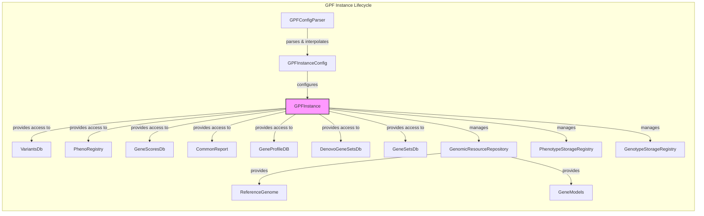

### Component Descriptions:

**1. GPFConfigParser**
   - *Purpose*: Parses and interpolates GPF configuration files, loading data from files and dictionaries.
   - *Functionality*: Reads configuration files, resolves variables, and provides a configuration object.
   - *Interaction*: Parses configuration files and provides the resulting configuration to `GPFInstance`.
   - *Relevant source files*: `dae.configuration.gpf_config_parser.GPFConfigParser`

**2. GPFInstanceConfig**
   - *Purpose*: Represents the configuration of a GPF instance.
   - *Functionality*: Holds the configuration parameters.
   - *Interaction*: Configures the `GPFInstance`.
   - *Relevant source files*: `dae.gpf_instance.gpf_instance.GPFInstance._build_gpf_config`

**3. GPFInstance**
   - *Purpose*: Represents a GPF instance, providing access to genomic resources and data.
   - *Functionality*: Manages configuration, genomic resources, and data access. It acts as a central hub.
   - *Interaction*: Uses `GPFConfigParser` to load configuration, manages `GenomicResourceRepository`, `VariantsDb`, `PhenoRegistry`, `GeneScoresDb`, `CommonReport`, `GeneProfileDB`, `DenovoGeneSetsDb`, `GeneSetsDb`, `PhenotypeStorageRegistry`, and `GenotypeStorageRegistry`.
   - *Relevant source files*: `dae.gpf_instance.gpf_instance.GPFInstance`

**4. VariantsDb**
   - *Purpose*: Manages access to variant data.
   - *Functionality*: Provides methods to retrieve genotype studies and groups.
   - *Interaction*: Accessed by `GPFInstance` to retrieve variant data.
   - *Relevant source files*: `dae.studies.variants_db.VariantsDb`

**5. PhenoRegistry**
   - *Purpose*: Manages access to phenotype data.
   - *Functionality*: Provides methods to retrieve phenotype data and configurations.
   - *Interaction*: Accessed by `GPFInstance` to retrieve phenotype data.
   - *Relevant source files*: `dae.pheno.registry.PhenoRegistry`

**6. GeneScoresDb**
   - *Purpose*: Manages access to gene scores.
   - *Functionality*: Provides methods to retrieve gene scores and descriptions.
   - *Interaction*: Accessed by `GPFInstance` to retrieve gene scores.
   - *Relevant source files*: `dae.gene_scores.gene_scores.GeneScoresDb`

**7. CommonReport**
   - *Purpose*: Loads and manages common reports for datasets.
   - *Functionality*: Provides access to common report data.
   - *Interaction*: Accessed by `GPFInstance` to retrieve common reports.
   - *Relevant source files*: `dae.common_reports.common_report.CommonReport`

**8. GeneProfileDB**
   - *Purpose*: Manages access to gene profile data.
   - *Functionality*: Provides methods to retrieve gene profiles.
   - *Interaction*: Accessed by `GPFInstance` to retrieve gene profiles.
   - *Relevant source files*: `dae.gene_profile.db.GeneProfileDB`

**9. DenovoGeneSetsDb**
   - *Purpose*: Manages denovo gene sets.
   - *Functionality*: Provides methods to retrieve denovo gene sets.
   - *Interaction*: Accessed by `GPFInstance` to retrieve denovo gene sets.
   - *Relevant source files*: `dae.gene_sets.denovo_gene_sets_db.DenovoGeneSetsDb`

**10. GeneSetsDb**
    - *Purpose*: Manages gene sets.
    - *Functionality*: Provides methods to retrieve gene sets.
    - *Interaction*: Accessed by `GPFInstance` to retrieve gene sets.
    - *Relevant source files*: `dae.gene_sets.gene_sets_db.GeneSetsDb`

**11. GenomicResourceRepository**
    - *Purpose*: Manages genomic resources.
    - *Functionality*: Provides access to genomic resources like reference genomes and gene models.
    - *Interaction*: Managed by `GPFInstance` to provide access to `ReferenceGenome` and `GeneModels`.
    - *Relevant source files*: `dae.genomic_resources.repository_factory.build_genomic_resource_repository`

**12. ReferenceGenome**
    - *Purpose*: Represents the reference genome.
    - *Functionality*: Provides access to the reference genome sequence.
    - *Interaction*: Provided by `GenomicResourceRepository` and used by various components.
    - *Relevant source files*: `dae.genomic_resources.reference_genome.build_reference_genome_from_resource`

**13. GeneModels**
    - *Purpose*: Represents gene models.
    - *Functionality*: Provides access to gene models data.
    - *Interaction*: Provided by `GenomicResourceRepository` and used by various components.
    - *Relevant source files*: `dae.genomic_resources.gene_models.gene_models.build_gene_models_from_resource`

**14. PhenotypeStorageRegistry**
    - *Purpose*: Manages phenotype storages.
    - *Functionality*: Provides access to different phenotype storage implementations.
    - *Interaction*: Managed by `GPFInstance` to handle phenotype storage.
    - *Relevant source files*: `dae.pheno.storage.PhenotypeStorageRegistry`

**15. GenotypeStorageRegistry**
    - *Purpose*: Manages genotype storages.
    - *Functionality*: Provides access to different genotype storage implementations.
    - *Interaction*: Managed by `GPFInstance` to handle genotype storage.
    - *Relevant source files*: `dae.genotype_storage.genotype_storage_registry.GenotypeStorageRegistry`
